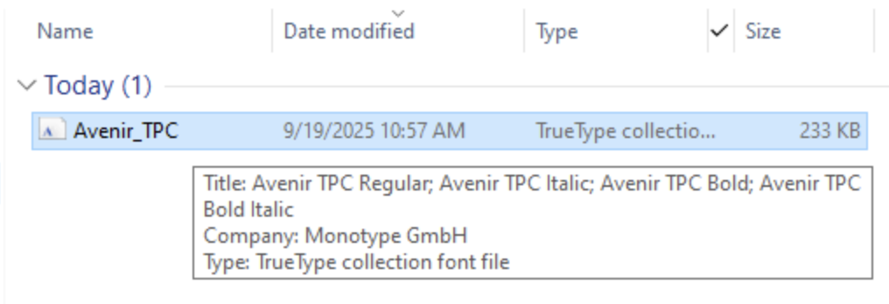
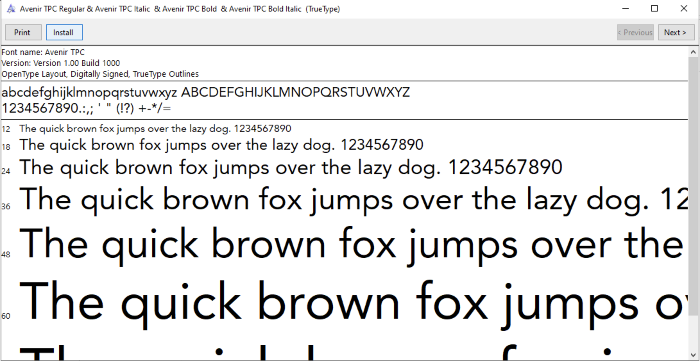

::::: {.callout-warning}
## STOP! - Required Setup

Before doing anything, you **must** download TPC's font to your computer.

**Step 1**: Download [this file](https://urbanorg.box.com/s/cj2gk9oqod0eq62f594tw7m7ycxjdst7)

{width=50%}

**Step 2**: Open the file from your downloads folder

{width=50%}

**Step 3**: Click "Install"

All done! If you have any questions about installing fonts, contact Lillian Hunter.
:::::

# Typography

taxpolicycenter.org uses the fonts *Avenir LT Pro* and *Calvert*. When possible, those fonts should also be used to create charts. If the "Avenir TPC" font family is not installed on your computer, please [download the font](https://urbanorg.box.com/s/cj2gk9oqod0eq62f594tw7m7ycxjdst7). Good chart typography creates a hierarchy among elements and guides the reader through the visual.

```{=html}
<table style="width: 100%; border-collapse: collapse; border: 1px solid #ddd;">
  <thead>
    <tr style="background-color: #f9f9f9; font-weight: bold;">
      <th style="border: 1px solid #ddd; padding: 12px; text-align: left; width: 12%;">Element</th>
      <th style="border: 1px solid #ddd; padding: 12px; text-align: left; width: 15%;">Typeface</th>
      <th style="border: 1px solid #ddd; padding: 12px; text-align: left; width: 10%;">Web Size</th>
      <th style="border: 1px solid #ddd; padding: 12px; text-align: left; width: 12%;">Print Size</th>
      <th style="border: 1px solid #ddd; padding: 12px; text-align: left; width: 10%;">Case</th>
      <th style="border: 1px solid #ddd; padding: 12px; text-align: left; width: 8%;">Color</th>
      <th style="border: 1px solid #ddd; padding: 12px; text-align: left; width: 33%;">Notes</th>
    </tr>
  </thead>
  <tbody>
    <tr>
      <td style="border: 1px solid #ddd; padding: 12px; color: #F0573E"><strong>FIGURE NUMBER</strong></td>
      <td style="border: 1px solid #ddd; padding: 12px;">Avenir TPC (bold)</td>
      <td style="border: 1px solid #ddd; padding: 12px;">11 (Not included in graph)</td>
      <td style="border: 1px solid #ddd; padding: 12px;">8</td>
      <td style="border: 1px solid #ddd; padding: 12px;">ALL CAPS</td>
      <td style="border: 1px solid #ddd; padding: 12px;">#F0573E</td>
      <td style="border: 1px solid #ddd; padding: 12px;"></td>
    </tr>
    <tr>
      <td style="border: 1px solid #ddd; padding: 12px;"><strong>Title</strong></td>
      <td style="border: 1px solid #ddd; padding: 12px;">Avenir TPC (bold)</td>
      <td style="border: 1px solid #ddd; padding: 12px;">20</td>
      <td style="border: 1px solid #ddd; padding: 12px;">12 (Not included in graph)</td>
      <td style="border: 1px solid #ddd; padding: 12px;">Title Case</td>
      <td style="border: 1px solid #ddd; padding: 12px;">#000000</td>
      <td style="border: 1px solid #ddd; padding: 12px;">The main point of the chart. Try to keep shorter than two lines and avoid qualifiers.</td>
    </tr>
    <tr>
      <td style="border: 1px solid #ddd; padding: 12px;"><strong>Subtitle</strong></td>
      <td style="border: 1px solid #ddd; padding: 12px;">Avenir TPC</td>
      <td style="border: 1px solid #ddd; padding: 12px;">16</td>
      <td style="border: 1px solid #ddd; padding: 12px;">9.5</td>
      <td style="border: 1px solid #ddd; padding: 12px;">Sentence case</td>
      <td style="border: 1px solid #ddd; padding: 12px;">#000000</td>
      <td style="border: 1px solid #ddd; padding: 12px;">Use this to add qualifiers or further clarification to the title.</td>
    </tr>
    <tr>
      <td style="border: 1px solid #ddd; padding: 12px;"><em>X and Y axis titles</em></td>
      <td style="border: 1px solid #ddd; padding: 12px;">Avenir TPC (Italic)</td>
      <td style="border: 1px solid #ddd; padding: 12px;">12</td>
      <td style="border: 1px solid #ddd; padding: 12px;">8.5</td>
      <td style="border: 1px solid #ddd; padding: 12px;">Sentence case</td>
      <td style="border: 1px solid #ddd; padding: 12px;">#000000</td>
      <td style="border: 1px solid #ddd; padding: 12px;">Always horizontal, above the top axis label. Include units or multipliers in parenthesis (millions), ($2014)</td>
    </tr>
    <tr>
      <td style="border: 1px solid #ddd; padding: 12px;"><strong>X and Y axis labels</strong></td>
      <td style="border: 1px solid #ddd; padding: 12px;">Avenir TPC</td>
      <td style="border: 1px solid #ddd; padding: 12px;">12</td>
      <td style="border: 1px solid #ddd; padding: 12px;">8.5</td>
      <td style="border: 1px solid #ddd; padding: 12px;">Sentence case</td>
      <td style="border: 1px solid #ddd; padding: 12px;">#000000</td>
      <td style="border: 1px solid #ddd; padding: 12px;">Always horizontal, avoid units or multipliers. Those should be added to the axis title in parenthesis.</td>
    </tr>
    <tr>
      <td style="border: 1px solid #ddd; padding: 12px;"><strong>Key labels</strong></td>
      <td style="border: 1px solid #ddd; padding: 12px;">Avenir TPC</td>
      <td style="border: 1px solid #ddd; padding: 12px;">12</td>
      <td style="border: 1px solid #ddd; padding: 12px;">9.5</td>
      <td style="border: 1px solid #ddd; padding: 12px;">Sentence case</td>
      <td style="border: 1px solid #ddd; padding: 12px;">#000000</td>
      <td style="border: 1px solid #ddd; padding: 12px;">Always horizontal. Avoid redundant key labels if possible.</td>
    </tr>
    <tr>
      <td style="border: 1px solid #ddd; padding: 12px;"><strong>Direct labels</strong></td>
      <td style="border: 1px solid #ddd; padding: 12px;">Avenir TPC</td>
      <td style="border: 1px solid #ddd; padding: 12px;">12</td>
      <td style="border: 1px solid #ddd; padding: 12px;">9.5</td>
      <td style="border: 1px solid #ddd; padding: 12px;">Sentence case</td>
      <td style="border: 1px solid #ddd; padding: 12px;">#000000</td>
      <td style="border: 1px solid #ddd; padding: 12px;">Use for line or column charts with three or fewer series.</td>
    </tr>
    <tr>
      <td style="border: 1px solid #ddd; padding: 12px;"><strong>Data-point label</strong></td>
      <td style="border: 1px solid #ddd; padding: 12px;">Avenir TPC</td>
      <td style="border: 1px solid #ddd; padding: 12px;">11</td>
      <td style="border: 1px solid #ddd; padding: 12px;">8.5</td>
      <td style="border: 1px solid #ddd; padding: 12px;">Sentence case</td>
      <td style="border: 1px solid #ddd; padding: 12px;">#000000</td>
      <td style="border: 1px solid #ddd; padding: 12px;">Always horizontal. No units or multipliers. Only directly label columns if there are fewer than 10 total columns.</td>
    </tr>
    <tr>
      <td style="border: 1px solid #ddd; padding: 12px;"><strong>Source and Notes</strong></td>
      <td style="border: 1px solid #ddd; padding: 12px;">Avenir TPC</td>
      <td style="border: 1px solid #ddd; padding: 12px;">11</td>
      <td style="border: 1px solid #ddd; padding: 12px;">8</td>
      <td style="border: 1px solid #ddd; padding: 12px;">Sentence case</td>
      <td style="border: 1px solid #ddd; padding: 12px;">#000000</td>
      <td style="border: 1px solid #ddd; padding: 12px;">Bold "Source:" and "Notes:" as well as any statistical significance indicators.</td>
    </tr>
  </tbody>
</table>
```


---

# Color

TPC's main colors are **deep blue**, **teal**, **black**, and **gray**<. **Poppy** (red-orange) is used as a highlight color throughout the new taxpolicycenter.org web site.

## Color Selection Principles


When selecting colors for charts and graphs, first consider the type of data you are presenting. Usually, data can be grouped into one of two main groups: categorical or sequential.

**Categorical palettes** are best when you want to distinguish discrete chunks of data that do not have an inherent ordering.

**Sequential color mapping** is appropriate when data range from relatively low or uninteresting values to relatively high or interesting values. For sequential data, it's better to use a palette that has a relatively subtle shift in hue accompanied by a large shift in brightness and saturation. This approach naturally draws the eye to the relatively important parts of the data.

For more information about the subtleties of color, refer to [this collection of blog posts](http://blog.visual.ly/?s=%22subtleties+of+color%22) from [Visual.ly](http://visual.ly/).

The following color combinations are intended to take some of the guess work out of the process of assigning colors to charts. They're only examples, and can be mixed-and-matched depending on the story you are trying to tell with your data.

### Color Combinations

## Main Graphic Colors

```{=html}
<table style="width: 100%; border-collapse: collapse;">
<tr>
<td style="background-color: #174a7c; color: white; padding: 20px; text-align: center; font-weight: bold; border: 1px solid #ddd;">Deep Blue<br>#174a7c</td>
<td style="background-color: #008bb0; color: white; padding: 20px; text-align: center; font-weight: bold; border: 1px solid #ddd;">Teal<br>#008bb0</td>
<td style="background-color: #F0573E  ; color: white; padding: 20px; text-align: center; font-weight: bold; border: 1px solid #ddd;">Poppy<br>#F0573E</td>
<td style="background-color: #bcbec0; color: white; padding: 20px; text-align: center; font-weight: bold; border: 1px solid #ddd;">Gray<br>#bcbec0</td>
</tr>
</table>
```

### One Group

```{=html}
<table style="width: 100%; border-collapse: collapse;">
<tr>
<td style="background-color: #174a7c; color: white; padding: 20px; text-align: center; font-weight: bold; border: 1px solid #ddd; width: 50%;">Deep Blue<br>#174a7c</td>
<td style="background-color: #008bb0; color: white; padding: 20px; text-align: center; font-weight: bold; border: 1px solid #ddd; width: 50%;">Teal<br>#008bb0</td>
</tr>
</table>
```

### Two Groups (Categorical)

**Option 1: Teal + Black**

```{=html}
<table style="width: 100%; border-collapse: collapse;">
<tr>
<td style="background-color: #008bb0; color: white; padding: 20px; text-align: center; font-weight: bold; border: 1px solid #ddd; width: 50%;">Teal<br>#008bb0</td>
<td style="background-color: #000000; color: white; padding: 20px; text-align: center; font-weight: bold; border: 1px solid #ddd; width: 50%;">Black<br>#000000</td>
</tr>
</table>
```

**Option 2: Teal + Gray**

```{=html}
<table style="width: 100%; border-collapse: collapse;">
<tr>
<td style="background-color: #008bb0; color: white; padding: 20px; text-align: center; font-weight: bold; border: 1px solid #ddd; width: 50%;">Teal<br>#008bb0</td>
<td style="background-color: #bcbec0; color: white; padding: 20px; text-align: center; font-weight: bold; border: 1px solid #ddd; width: 50%;">Gray<br>#bcbec0</td>
</tr>
</table>
```

**Option 3: Teal + Yellow**

```{=html}
<table style="width: 100%; border-collapse: collapse;">
<tr>
<td style="background-color: #008bb0; color: white; padding: 20px; text-align: center; font-weight: bold; border: 1px solid #ddd; width: 50%;">Teal<br>#008bb0</td>
<td style="background-color: #fcb64b; color: black; padding: 20px; text-align: center; font-weight: bold; border: 1px solid #ddd; width: 50%;">Yellow<br>#fcb64b</td>
</tr>
</table>
```

**Option 4: Poppy + Black**

```{=html}
<table style="width: 100%; border-collapse: collapse;">
<tr>
<td style="background-color: #F0573E; color: white; padding: 20px; text-align: center; font-weight: bold; border: 1px solid #ddd; width: 50%;">Poppy<br>#F0573E</td>
<td style="background-color: #000000; color: white; padding: 20px; text-align: center; font-weight: bold; border: 1px solid #ddd; width: 50%;">Black<br>#000000</td>
</tr>
</table>
```

**Option 5: Poppy + Deep Blue**

```{=html}
<table style="width: 100%; border-collapse: collapse;">
<tr>
<td style="background-color: #F0573E; color: white; padding: 20px; text-align: center; font-weight: bold; border: 1px solid #ddd; width: 50%;">Poppy<br>#F0573E</td>
<td style="background-color: #174a7c; color: white; padding: 20px; text-align: center; font-weight: bold; border: 1px solid #ddd; width: 50%;">Deep Blue<br>#174a7c</td>
</tr>
</table>
```

### Two Groups (Sequential)

```{=html}
<table style="width: 100%; border-collapse: collapse;">
<tr>
<td style="background-color: #008bb0; color: white; padding: 20px; text-align: center; font-weight: bold; border: 1px solid #ddd; width: 50%;">Teal (Dark)<br>#008bb0</td>
<td style="background-color: #b0d0db; color: black; padding: 20px; text-align: center; font-weight: bold; border: 1px solid #ddd; width: 50%;">Teal (Light)<br>#b0d0db</td>
</tr>
</table>
```

### Three Groups (Categorical)

**Option 1: Teal + Poppy + Yellow**

```{=html}
<table style="width: 100%; border-collapse: collapse;">
<tr>
<td style="background-color: #008bb0; color: white; padding: 20px; text-align: center; font-weight: bold; border: 1px solid #ddd; width: 33.33%;">Teal<br>#008bb0</td>
<td style="background-color: #F0573E; color: white; padding: 20px; text-align: center; font-weight: bold; border: 1px solid #ddd; width: 33.33%;">Poppy<br>#F0573E</td>
<td style="background-color: #fcb64b; color: black; padding: 20px; text-align: center; font-weight: bold; border: 1px solid #ddd; width: 33.33%;">Yellow<br>#fcb64b</td>
</tr>
</table>
```

**Option 2: Teal + Yellow + Black**

```{=html}
<table style="width: 100%; border-collapse: collapse;">
<tr>
<td style="background-color: #008bb0; color: white; padding: 20px; text-align: center; font-weight: bold; border: 1px solid #ddd; width: 33.33%;">Teal<br>#008bb0</td>
<td style="background-color: #fcb64b; color: black; padding: 20px; text-align: center; font-weight: bold; border: 1px solid #ddd; width: 33.33%;">Yellow<br>#fcb64b</td>
<td style="background-color: #000000; color: white; padding: 20px; text-align: center; font-weight: bold; border: 1px solid #ddd; width: 33.33%;">Black<br>#000000</td>
</tr>
</table>
```

**Option 3: Gray + Deep Blue + Poppy**

```{=html}
<table style="width: 100%; border-collapse: collapse;">
<tr>
<td style="background-color: #bcbec0; color: white; padding: 20px; text-align: center; font-weight: bold; border: 1px solid #ddd; width: 33.33%;">Gray<br>#bcbec0</td>
<td style="background-color: #174a7c; color: white; padding: 20px; text-align: center; font-weight: bold; border: 1px solid #ddd; width: 33.33%;">Deep Blue<br>#174a7c</td>
<td style="background-color: #F0573E; color: white; padding: 20px; text-align: center; font-weight: bold; border: 1px solid #ddd; width: 33.33%;">Poppy<br>#F0573E</td>
</tr>
</table>
```

### Three Groups (Sequential)

```{=html}
<table style="width: 100%; border-collapse: collapse;">
<tr>
<td style="background-color: #b0d0db; color: black; padding: 20px; text-align: center; font-weight: bold; border: 1px solid #ddd; width: 33.33%;">Teal (1/3)<br>#b0d0db</td>
<td style="background-color: #75adc0; color: white; padding: 20px; text-align: center; font-weight: bold; border: 1px solid #ddd; width: 33.33%;">Teal (2/3)<br>#75adc0</td>
<td style="background-color: #008bb0; color: white; padding: 20px; text-align: center; font-weight: bold; border: 1px solid #ddd; width: 33.33%;">Teal<br>#008bb0</td>
</tr>
</table>
```

### Four Groups (Categorical)

**Option 1: Deep Blue + Poppy + Yellow + Teal**

```{=html}
<table style="width: 100%; border-collapse: collapse;">
<tr>
<td style="background-color: #174a7c; color: white; padding: 20px; text-align: center; font-weight: bold; border: 1px solid #ddd; width: 25%;">Deep Blue<br>#174a7c</td>
<td style="background-color: #F0573E; color: white; padding: 20px; text-align: center; font-weight: bold; border: 1px solid #ddd; width: 25%;">Poppy<br>#F0573E</td>
<td style="background-color: #fcb64b; color: black; padding: 20px; text-align: center; font-weight: bold; border: 1px solid #ddd; width: 25%;">Yellow<br>#fcb64b</td>
<td style="background-color: #008bb0; color: white; padding: 20px; text-align: center; font-weight: bold; border: 1px solid #ddd; width: 25%;">Teal<br>#008bb0</td>
</tr>
</table>
```

**Option 2: Teal + Black + Poppy + Gray**

```{=html}
<table style="width: 100%; border-collapse: collapse;">
<tr>
<td style="background-color: #008bb0; color: white; padding: 20px; text-align: center; font-weight: bold; border: 1px solid #ddd; width: 25%;">Teal<br>#008bb0</td>
<td style="background-color: #000000; color: white; padding: 20px; text-align: center; font-weight: bold; border: 1px solid #ddd; width: 25%;">Black<br>#000000</td>
<td style="background-color: #F0573E; color: white; padding: 20px; text-align: center; font-weight: bold; border: 1px solid #ddd; width: 25%;">Poppy<br>#F0573E</td>
<td style="background-color: #bcbec0; color: white; padding: 20px; text-align: center; font-weight: bold; border: 1px solid #ddd; width: 25%;">Gray<br>#bcbec0</td>
</tr>
</table>
```

### Four Groups (Sequential)

```{=html}
<table style="width: 100%; border-collapse: collapse;">
<tr>
<td style="background-color: #b0d0db; color: black; padding: 20px; text-align: center; font-weight: bold; border: 1px solid #ddd; width: 25%;">Teal (1/4)<br>#b0d0db</td>
<td style="background-color: #75adc0; color: white; padding: 20px; text-align: center; font-weight: bold; border: 1px solid #ddd; width: 25%;">Teal (2/4)<br>#75adc0</td>
<td style="background-color: #008bb0; color: white; padding: 20px; text-align: center; font-weight: bold; border: 1px solid #ddd; width: 25%;">Teal<br>#008bb0</td>
<td style="background-color: #1d5669; color: white; padding: 20px; text-align: center; font-weight: bold; border: 1px solid #ddd; width: 25%;">Teal (4/4)<br>#1d5669</td>
</tr>
</table>
```

### Five Groups (Categorical)

**Option 1: Deep Blue + Poppy + Yellow + Teal + Gray**

```{=html}
<table style="width: 100%; border-collapse: collapse;">
<tr>
<td style="background-color: #174a7c; color: white; padding: 20px; text-align: center; font-weight: bold; border: 1px solid #ddd; width: 20%;">Deep Blue<br>#174a7c</td>
<td style="background-color: #F0573E; color: white; padding: 20px; text-align: center; font-weight: bold; border: 1px solid #ddd; width: 20%;">Poppy<br>#F0573E</td>
<td style="background-color: #fcb64b; color: black; padding: 20px; text-align: center; font-weight: bold; border: 1px solid #ddd; width: 20%;">Yellow<br>#fcb64b</td>
<td style="background-color: #008bb0; color: white; padding: 20px; text-align: center; font-weight: bold; border: 1px solid #ddd; width: 20%;">Teal<br>#008bb0</td>
<td style="background-color: #bcbec0; color: white; padding: 20px; text-align: center; font-weight: bold; border: 1px solid #ddd; width: 20%;">Gray<br>#bcbec0</td>
</tr>
</table>
```

**Option 2: Teal + Teal (2/6) + Teal-Gray + Poppy + Deep Blue**

```{=html}
<table style="width: 100%; border-collapse: collapse;">
<tr>
<td style="background-color: #008bb0; color: white; padding: 20px; text-align: center; font-weight: bold; border: 1px solid #ddd; width: 20%;">Teal<br>#008bb0</td>
<td style="background-color: #95c0cf; color: black; padding: 20px; text-align: center; font-weight: bold; border: 1px solid #ddd; width: 20%;">Teal (2/6)<br>#95c0cf</td>
<td style="background-color: #3f4f56; color: white; padding: 20px; text-align: center; font-weight: bold; border: 1px solid #ddd; width: 20%;">Teal-Gray<br>#3f4f56</td>
<td style="background-color: #F0573E; color: white; padding: 20px; text-align: center; font-weight: bold; border: 1px solid #ddd; width: 20%;">Poppy<br>#F0573E</td>
<td style="background-color: #174a7c; color: white; padding: 20px; text-align: center; font-weight: bold; border: 1px solid #ddd; width: 20%;">Deep Blue<br>#174a7c</td>
</tr>
</table>
```

**Option 3: Teal + Yellow + Teal-Gray + Poppy + Deep Blue**

```{=html}
<table style="width: 100%; border-collapse: collapse;">
<tr>
<td style="background-color: #008bb0; color: white; padding: 20px; text-align: center; font-weight: bold; border: 1px solid #ddd; width: 20%;">Teal<br>#008bb0</td>
<td style="background-color: #fcb64b; color: black; padding: 20px; text-align: center; font-weight: bold; border: 1px solid #ddd; width: 20%;">Yellow<br>#fcb64b</td>
<td style="background-color: #3f4f56; color: white; padding: 20px; text-align: center; font-weight: bold; border: 1px solid #ddd; width: 20%;">Teal-Gray<br>#3f4f56</td>
<td style="background-color: #F0573E; color: white; padding: 20px; text-align: center; font-weight: bold; border: 1px solid #ddd; width: 20%;">Poppy<br>#F0573E</td>
<td style="background-color: #174a7c; color: white; padding: 20px; text-align: center; font-weight: bold; border: 1px solid #ddd; width: 20%;">Deep Blue<br>#174a7c</td>
</tr>
</table>
```

### Five Groups (Sequential)

```{=html}
<table style="width: 100%; border-collapse: collapse;">
<tr>
<td style="background-color: #b0d0db; color: black; padding: 20px; text-align: center; font-weight: bold; border: 1px solid #ddd; width: 20%;">Teal (1/5)<br>#b0d0db</td>
<td style="background-color: #75adc0; color: black; padding: 20px; text-align: center; font-weight: bold; border: 1px solid #ddd; width: 20%;">Teal (2/5)<br>#75adc0</td>
<td style="background-color: #008bb0; color: white; padding: 20px; text-align: center; font-weight: bold; border: 1px solid #ddd; width: 20%;">Teal<br>#008bb0</td>
<td style="background-color: #1d5669; color: white; padding: 20px; text-align: center; font-weight: bold; border: 1px solid #ddd; width: 20%;">Teal (4/5)<br>#1d5669</td>
<td style="background-color: #0e2b35; color: white; padding: 20px; text-align: center; font-weight: bold; border: 1px solid #ddd; width: 20%;">Teal (5/5)<br>#0e2b35</td>
</tr>
</table>
```

### Six Groups (Categorical)

**Option 1: Deep Blue + Poppy + Yellow + Teal + Gray + Black**

```{=html}
<table style="width: 100%; border-collapse: collapse;">
<tr>
<td style="background-color: #174a7c; color: white; padding: 20px; text-align: center; font-weight: bold; border: 1px solid #ddd; width: 16.66%;">Deep Blue<br>#174a7c</td>
<td style="background-color: #F0573E; color: white; padding: 20px; text-align: center; font-weight: bold; border: 1px solid #ddd; width: 16.66%;">Poppy<br>#F0573E</td>
<td style="background-color: #fcb64b; color: black; padding: 20px; text-align: center; font-weight: bold; border: 1px solid #ddd; width: 16.66%;">Yellow<br>#fcb64b</td>
<td style="background-color: #008bb0; color: white; padding: 20px; text-align: center; font-weight: bold; border: 1px solid #ddd; width: 16.66%;">Teal<br>#008bb0</td>
<td style="background-color: #bcbec0; color: white; padding: 20px; text-align: center; font-weight: bold; border: 1px solid #ddd; width: 16.66%;">Gray<br>#bcbec0</td>
<td style="background-color: #000000; color: white; padding: 20px; text-align: center; font-weight: bold; border: 1px solid #ddd; width: 16.66%;">Black<br>#000000</td>
</tr>
</table>
```

**Option 2: Teal + Teal (2/6) + Teal-Gray + Poppy + Deep Blue + Gray**

```{=html}
<table style="width: 100%; border-collapse: collapse;">
<tr>
<td style="background-color: #008bb0; color: white; padding: 20px; text-align: center; font-weight: bold; border: 1px solid #ddd; width: 16.66%;">Teal<br>#008bb0</td>
<td style="background-color: #95c0cf; color: black; padding: 20px; text-align: center; font-weight: bold; border: 1px solid #ddd; width: 16.66%;">Teal (2/6)<br>#95c0cf</td>
<td style="background-color: #3f4f56; color: white; padding: 20px; text-align: center; font-weight: bold; border: 1px solid #ddd; width: 16.66%;">Teal-Gray<br>#3f4f56</td>
<td style="background-color: #F0573E; color: white; padding: 20px; text-align: center; font-weight: bold; border: 1px solid #ddd; width: 16.66%;">Poppy<br>#F0573E</td>
<td style="background-color: #174a7c; color: white; padding: 20px; text-align: center; font-weight: bold; border: 1px solid #ddd; width: 16.66%;">Deep Blue<br>#174a7c</td>
<td style="background-color: #bcbec0; color: white; padding: 20px; text-align: center; font-weight: bold; border: 1px solid #ddd; width: 16.66%;">Gray<br>#bcbec0</td>
</tr>
</table>
```

### Six Groups (Sequential)

```{=html}
<table style="width: 100%; border-collapse: collapse;">
<tr>
<td style="background-color: #cae0e7; color: black; padding: 20px; text-align: center; font-weight: bold; border: 1px solid #ddd; width: 16.66%;">Teal (1/6)<br>#cae0e7</td>
<td style="background-color: #95c0cf; color: black; padding: 20px; text-align: center; font-weight: bold; border: 1px solid #ddd; width: 16.66%;">Teal (2/6)<br>#95c0cf</td>
<td style="background-color: #60a1b6; color: white; padding: 20px; text-align: center; font-weight: bold; border: 1px solid #ddd; width: 16.66%;">Teal (3/6)<br>#60a1b6</td>
<td style="background-color: #008bb0; color: white; padding: 20px; text-align: center; font-weight: bold; border: 1px solid #ddd; width: 16.66%;">Teal<br>#008bb0</td>
<td style="background-color: #1d5669; color: white; padding: 20px; text-align: center; font-weight: bold; border: 1px solid #ddd; width: 16.66%;">Teal (5/6)<br>#1d5669</td>
<td style="background-color: #0e2b35; color: white; padding: 20px; text-align: center; font-weight: bold; border: 1px solid #ddd; width: 16.66%;">Teal (6/6)<br>#0e2b35</td>
</tr>
</table>
```

### Seven or More Groups ⚠️

**Consider consolidating categories or breaking up the chart. Seven groups is really too many.**

