::::: {.callout-warning collapse=true}
## STOP! - Required Font Setup

Before doing anything, you **must** download TPC's font to your computer.

**Step 1**: Download [this file](https://urbanorg.box.com/s/cj2gk9oqod0eq62f594tw7m7ycxjdst7)

{width=50%}

**Step 2**: Open the file from your downloads folder

{width=50%}

**Step 3**: Click "Install"

All done! If you have any questions about installing fonts, contact Lillian Hunter.
:::::

# How and when to create effective graphs, maps, and charts

::: {.callout-tip collapse=false}

## How and when to create effective graphs, maps, and charts

> This section excerpts and condenses [Urban Institute's Data Visualization Style Guide, "Creating Effective Charts."](https://urbaninstitute.github.io/graphics-styleguide/)

**Ask - Do you even need a graph here?** If your chart only has two or three values, consider a couple of sentences of text to explain the figure instead. If you find your explanatory sentences do a better job of distilling the information, you might want to consider going without a chart.

**Be consistent**. Once you’ve chosen blue to represent one group in one chart, make sure all other charts in your publication or slide deck use blue to represent that group as well. This consistency makes reading and comprehension easier for your reader.

**Keep it simple**. Don’t try to stuff every data value into a single graph. This doesn’t mean you need to strip out all your data, but **consider what you want your reader to come away with**. 

**Strategically guide your reader's eye through your chart:**

- **Small multiples.** The small multiples approach is exactly what it sounds like: create a series of smaller graphs positioned in close proximity. Breaking a single larger, complex graph into smaller pieces can not only make a complex graph easier for readers to comprehend but also help create a sense of movement by aligning changes over time in a particular order. 
   - Each multiple should be the same type, shape, and size and use the same type of scales, which should start and end at the same values. The best way to think about small multiples is to take a single, dense graph and break it up into many charts—in other words, the framing elements of the chart should not change. 
   - Try to order the small multiple graphs in a meaningful way—for example, by some value, geographic location, or even alphabetically.
- **Highlighting.** Highlighting can call attention to specific data points in very dense charts. The observations you want the reader to focus on should be rendered in a color that helps them stand out (usually pink or yellow at Urban), while the rest of the series are in a different color (usually blue, black, or gray). However, be selective with your use of color to highlight specific values, series, or observations, because too many colors can make it difficult to pick out the values on which you want your reader to focus.
- **Reference lines.** There may be times when you want to include a reference line or pointer for a specific event, threshold, or benchmark. In such cases, make sure that your line is measured precisely. For example, if you are marking June 2010 in a line chart, the reference line should be located halfway between 2010 and 2011.

**Use supporting text:**

- Always include a text reference to your figure to explain the relevance of the chart to your argument.
- **Title.** Keep it concise and active. Try to explain the chart in a few words. If you need to add qualifiers (e.g., years, dollars) or further clarification, use a subtitle. For bonus credit: consider writing a title that ["works as a headline"](https://policyviz.com/2018/04/12/three-ways-to-annotate-your-graphs/#google_vignette) and conveys the main point the reader should take away from the graph.
- **Source and Notes.** This is where the technical information about methodology can go. Try to avoid putting this information in the title, labels, or on the chart.
- **Legends.** Stretch legends across the top of the chart, or to the right. Order them in a logical way, mirroring the order of the data in the charts.
- **Annotation.** Annotation is one of the most important ways to improve your data communication efforts. There are two primary ways to annotate your visualizations. First, adding explanatory text within the graph itself can highlight specific values or explain content. Second, you can add a layer of annotation to explain how to read the graph. This approach can be especially useful for readers who may not be familiar with a particular graph type. For example, you could add a pointer that denotes how the values get larger or smaller along each axis in a scatterplot.
- **Data labels and markers.** When possible, avoid using legends and instead directly label the data on the graph. Endeavor to evenly space and align the labels instead of scattering them around the graph, which can make it difficult for your reader to find the label and risks emphasizing one series or data value over another. On a line chart, for example, you might place the labels at the far right of the graph, slightly outside the graph space, but left-aligned.

**Avoid the following:**
 
- Nonzero baselines
- Dual axis charts
- Pie charts with too many slices
- Too many categories


Refer to the Urban style guide for further elaboration on this guidance, and information on how to mark outliers, show uncertainty, and tradeoffs between comprehensibility and complexity. 

**What kind of chart should I use?**

```{=html}
<table style="width: 100%; border-collapse: collapse; border: 1px solid #ddd;">
  <thead>
    <tr style="background-color: #f9f9f9; font-weight: bold;">
      <th style="border: 1px solid #ddd; padding: 12px; text-align: left; width: 12%;">I want to...</th>
      <th style="border: 1px solid #ddd; padding: 12px; text-align: left; width: 15%;"></th>
    </tr>
  </thead>
  <tbody>
    <tr>
      <td style="border: 1px solid #ddd; padding: 12px;">Compare values or rankings</td>
      <td style="border: 1px solid #ddd; padding: 12px;">
        <ul>
          <li>Bar charts</li>
          <li>Dot plots</li>
        </ul>
      </td>
    </tr>
    <tr>
      <td style="border: 1px solid #ddd; padding: 12px;">Show trends or change over time</td>
      <td style="border: 1px solid #ddd; padding: 12px;">
        <ul>
          <li>Area charts</li>
          <li>Bar charts</li>
          <li>Connected scatterplots</li>
          <li>Dot plots</li>
          <li>Gantt charts</li>
          <li>Line charts</li>
          <li>Slope charts</li>
          <li>Sparklines</li>
        </ul>
      </td>
    </tr>
    <tr>
      <td style="border: 1px solid #ddd; padding: 12px;">Depict a part-to-whole relationship</td>
      <td style="border: 1px solid #ddd; padding: 12px;">
        <ul>          	
          <li>Pie/donut charts</li>
          <li>Stacked bar charts</li>
          <li>Stacked area charts</li>
          <li>Tree maps</li>
          <li>Unit/waffle charts</li>
        </ul>
      </td>
    </tr>
    <tr>
      <td style="border: 1px solid #ddd; padding: 12px;">Show deviation from a reference point</td>
      <td style="border: 1px solid #ddd; padding: 12px;">
        <ul>          	
          <li>Bubble charts</li>
          <li>Heatmaps</li>
          <li>Scatterplots</li>
        </ul>
      </td>
    </tr>
    <tr>
      <td style="border: 1px solid #ddd; padding: 12px;">Show the distribution of values</td>
      <td style="border: 1px solid #ddd; padding: 12px;">
        <ul>          	
          <li>Beeswarm charts</li>
          <li>Box and whisker plots</li>
          <li>Fan/confidence interval plots</li>
          <li>Histograms</li>
          <li>Strip charts</li>
        </ul>
      </td>
    </tr>
  </tbody>
  </table>
```

:::

# Tools

**Which tools can I use to create publication-ready graphics?**

```{=html}
<table>
  <thead>
    <tr style="background-color: #f9f9f9; font-weight: bold;">
      <th style="border: 1px solid #ddd; padding: 12px; text-align: left;">Tool</th>
      <th style="border: 1px solid #ddd; padding: 12px; text-align: left">Supports graphs?</th>
      <th style="border: 1px solid #ddd; padding: 12px; text-align: left;">Supports tables?</th>
      <th style="border: 1px solid #ddd; padding: 12px; text-align: left; ">Supports maps?</th>
    </tr>
  </thead>
  <tbody>
    <tr>
      <td style="border: 1px solid #ddd; padding: 12px;">Datawrapper</td>
      <td style="border: 1px solid #ddd; padding: 12px;">&#10003;</td>
      <td style="border: 1px solid #ddd; padding: 12px;">&#10003;</td>
      <td style="border: 1px solid #ddd; padding: 12px;">&#10003;</td>
    </tr>
    <tr>
      <td style="border: 1px solid #ddd; padding: 12px;">Excel</td>
      <td style="border: 1px solid #ddd; padding: 12px;">&#10003;</td>
      <td style="border: 1px solid #ddd; padding: 12px;">&#10007;</td>
      <td style="border: 1px solid #ddd; padding: 12px;">&#10003;</td>
    </tr>
    <tr>
      <td style="border: 1px solid #ddd; padding: 12px;">R</td>
      <td style="border: 1px solid #ddd; padding: 12px;">&#10003;</td>
      <td style="border: 1px solid #ddd; padding: 12px;">&#10003;</td>
      <td style="border: 1px solid #ddd; padding: 12px;">&#10007;</td>
    </tr>
  </tbody>
</table>

```

## Datawrapper

Datawrapper is an online, browser-based tool that enables users to create interactive and responsive charts, tables, and choropleth maps. Sensitive data or data with PII should not be used. [Here's](https://www.datawrapper.de/blog/chart-types-guide) an overview of chart types supported in Datawrapper.

Datawrapper graphs are appropriate for web-only publications like blogs and features. Contact tpc-analysts to have Datawrapper graphs made with TPC styling for blog posts, social media, or other online uses.

## Excel

**Graphs**: TPC's Excel add-in creates publication-ready TPC Graphs. Graphs are sized to match the main dimensions in TPC publications (approximately 6.75" wide or 720 px in Excel.) The main dimensions for TPC publications is approximately 6.75" wide or 720px in Excel. Because Excel's chart title and subtitle fields are limiting in terms of formatting, we use a regular text box for all the text at the top of the graphic, as well as the source and notes text at the bottom. We also include a TPC logo in the upper-right corner of the figure so that TPC's brand travels with the chart when members of the media or other viewers copy and paste it into their stories. If you use the add-in tool, the logo and chart parts will automatically size properly. **DO NOT RESIZE CHARTS.** 


#### Graphs for Web


#### Graphs for Print

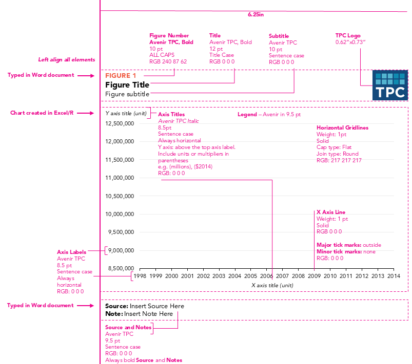

**Tables**: Tables can be formatted manually in Excel to match the example tables provided in TPC's [publication templates](publications.qmd#templates)

## R

`tpcthemes` is a set of utilites designed to layer over `urbnthemes` and `urbnmapr` to create static, TPC-themed plots and maps in R. `tpcthemes` is in development. 

```r
install.packages("remotes")
remotes::install_github("ui-research/tpcthemes")
```

You must have Github credentials configured in your R environment in order to access this package.

`datawRappr` can also be used to create interactive Datawrapper figures, maps, and tables using R. 

---


# Examples

The following examples use the styles and colors to illustrate common chart types. [Download the master example file](excel-files/chart-styles.xlsx).

## Bar and Column Charts

### When to Use a Bar or Column Chart

- For mostly one variable
- To compare numerical values for different observations
- To show relative amounts
- To break one numerical variable out into different subgroups with grouped or stacked bars or columns

### Style Tips

- Avoid 3D bars or columns
- The y-axis should start at zero ([there are a few instances when it is okay](http://qz.com/418083/its-ok-not-to-start-your-y-axis-at-zero/))
- The width of the bars should be about twice the width of the space between the bars
- If all the bars measure the same variable, make them all the same color. Different shades have no relevance to the data
- If you are showing fewer than 10 bars, consider eliminating the horizontal gridlines and y-axis line and directly labeling the data points
- To differentiate subsets of data, projections, or averages, consider using a different color shade or gray
- Legends should be stretched across the top of the chart and the order should match the order in the chart
- Sequential series should be shaded from lightest to darkest for easy comparison

### Column Chart Examples

::: {.panel-tabset}

#### R

```{r column-1}
#| message: FALSE
#| warning: FALSE
#| fig-width: 10
#| fig-height: 6
#| fig-format: png
#| dpi: 100
library(ggplot2)
library(dplyr)
library(tpcthemes)
library(extrafont)
invisible(capture.output(avenir_import()))
extrafont::loadfonts(device = "win", quiet = TRUE)
# Create data frame
tax_data <- data.frame(
  Income = c("$0–$24,600", 
             "$24,600–$45,300", 
             "$45,300–$66,400", 
             "$66,400–$97,500",
             "$97,500 and above",
             "$1,453,100 and above"),
  TaxRate = c(1.9, 7.0, 11.2, 15.2, 23.4, 29.0)
)

# Convert Income to factor to preserve order
tax_data$Income <- factor(tax_data$Income, levels = tax_data$Income)

# Create column chart with TPC styling
ggplot(tax_data, aes(x = Income, y = TaxRate)) +
  geom_col(fill = "#174a7c", width = 0.7) +
  labs(
    title = "Average Federal Tax Rates",
    subtitle = "All households, 2011, including income, payroll, corporate, and excise taxes",
    caption = "Source: Tax Policy Center",
    y = NULL
  ) +
  scale_y_continuous(labels = scales::percent_format(scale = 1),
                      limits = c(0, 30),
                     expand = expansion(mult = c(0, 0.02), add = c(0, 0))) +
  scale_x_discrete(labels = stringr::str_wrap(tax_data$Income, width = 6, whitespace_only = FALSE)) +
  tpc_theme() +
  theme(axis.text.x = element_text(lineheight = 0.8, margin = margin(t = 5)))
```

#### Excel

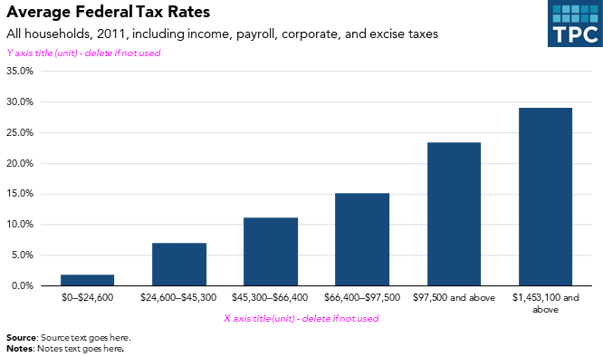

:::

::: {.panel-tabset}

#### R

```{r column-2}
#| message: FALSE
#| warning: FALSE
#| fig-width: 10
#| fig-height: 6
#| fig-format: png
#| dpi: 300
library(ggplot2)
library(dplyr)
library(tpcthemes)

# these lines are only needed once per session to load the Avenir font family
library(extrafont)
invisible(capture.output(avenir_import()))
extrafont::loadfonts(device = "win", quiet = TRUE)

# Create data frame
tax_data <- data.frame(
  Income = c("$10,000–$15,000", 
             "$20,000–$30,000", 
             "$30,000–$40,000", 
             "$50,000–$75,000",
             "$75,000–$100,000",
             "$200,000 and above"),
  TaxRate = c(21.5, 23.2, 23.0, 22.2, 21.5, 15.6)
)

tax_data$Income <- factor(tax_data$Income, levels = tax_data$Income)

ggplot(tax_data, aes(x = Income, y = TaxRate)) +
  geom_col(fill = "#174a7c", width = 0.7) +
  geom_text(aes(label = paste0(TaxRate, "%")), 
            vjust = -0.5, 
            family = "Avenir TPC",
            size = 3.5) +
  labs(title = "National Retail Sales as a Percentage of Income",
       subtitle = "Estimates include prebate",
       y = NULL,
       caption = "Source: Tax Policy Center") +
  scale_y_continuous(labels = scales::percent_format(scale = 1), 
                      limits = c(0, 25),
                     expand = expansion(mult = c(0, 0.02),  add = c(0, 0))) +
  scale_x_discrete(labels = stringr::str_wrap(tax_data$Income, width = 8, whitespace_only = FALSE)) +
  tpc_theme() +
  theme(axis.text.x = element_text(lineheight = 0.8, margin = margin(t = 5)),
        axis.text.y = element_blank(),
        axis.ticks.y = element_blank())
```

#### Excel

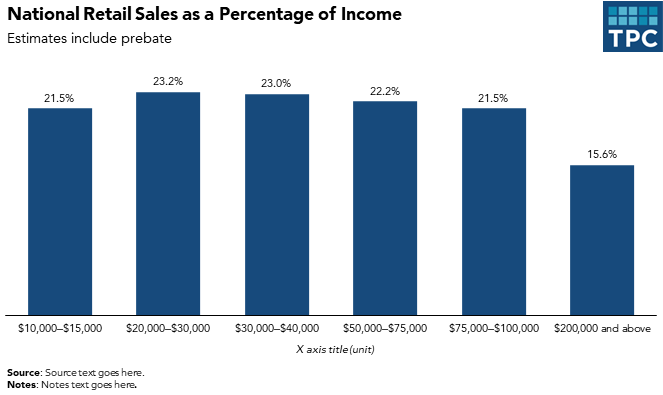

:::

**Notes about these charts:**

- Columns on the right in the "Top 10 percent" are a lighter sequential shade to differentiate them from the quintiles
- The "All" category is shaded gray to create visual contrast from the rest of the columns
- The right chart uses direct data labels above the bars for easier reading

::: {.panel-tabset}

#### R

```{r column-chart}
#| message: FALSE
#| warning: FALSE
#| fig-width: 10
#| fig-height: 6
#| fig-format: png
#| dpi: 300
library(ggplot2)
library(tibble)
library(tpcthemes)

extrafont::loadfonts(device = "win", quiet = TRUE)

# Create dataset with blank space
data <- tribble(
  ~category, ~value, ~color_group,
  "Lowest quintile", -9.8, "Dark",
  "Second quintile", -19.1, "Dark",
  "Middle quintile", -11.6, "Dark",
  "Fourth quintile", -8.4, "Dark",
  "Top quintile", -9.1, "Dark",
  "All", -9.4, "Dark",
  "", NA, NA,  # Blank space
  "Top 10 percent", -9.5, "Light",
  "Top 5 percent", -10.4, "Light",
  "Top 1 percent", -13.4, "Light",
  "Top 0.5 percent", -13.9, "Light",
  "Top 0.1 percent", -13.7, "Light"
)

# Convert category to factor to preserve order
data$category <- factor(data$category, levels = data$category)

# Define custom colors
colors <- c("Dark" = "#174a7c", "Light" = "#b0d0db")

# Create bar chart
ggplot(data, aes(x = category, y = value, fill = color_group)) +
  geom_bar(stat = "identity", na.rm = TRUE) +
  scale_fill_manual(values = colors, na.translate = FALSE) +
  labs(
    title = "Combined Effect of the 2001–06 Tax Cuts",
    subtitle = "Average percent federal tax change by cash income percentile, 2010",
    x = NULL,
    y = NULL,
    caption = "Source: Urban-Brookings Tax Policy Center Microsimulation Model (version 1006-1)"
  ) +
  tpc_theme() + 
  scale_x_discrete(position = "top",
                   labels = function(x) stringr::str_wrap(x, width = 10, whitespace_only = FALSE)) +
  scale_y_continuous(labels = scales::percent_format(scale = 1), 
                     expand = expansion(mult = 0, add = 0)) +
  theme(legend.position = "none",
        axis.ticks.x = element_blank()) 
```

#### Excel

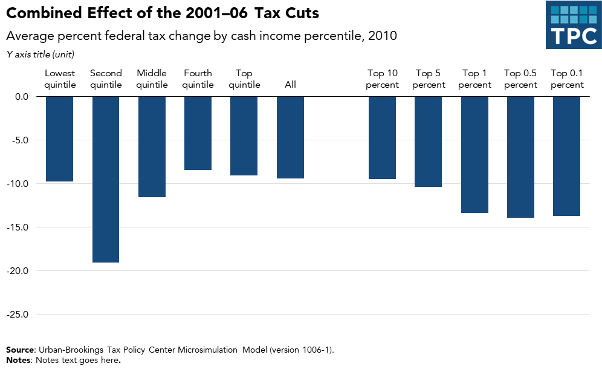

:::

::: {.panel-tabset}

#### Excel

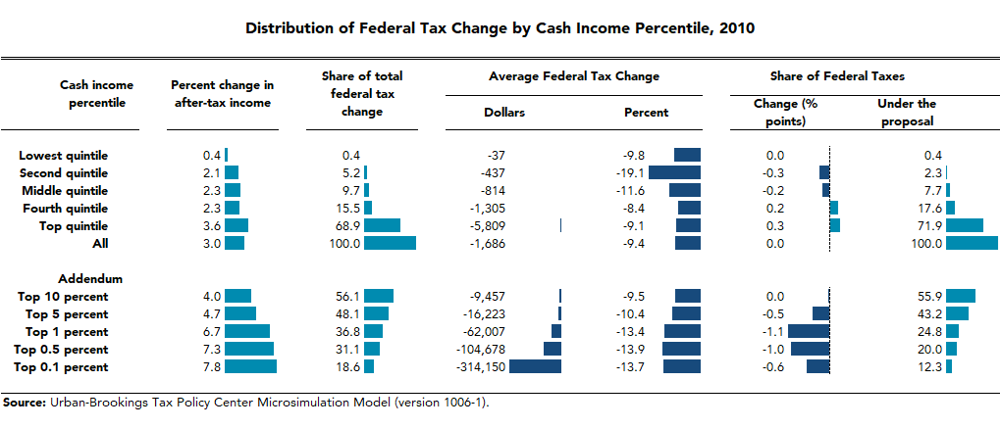

:::

::: {.panel-tabset}

#### R

```{r grouped-column-3}
#| message: FALSE
#| warning: FALSE
#| fig-width: 10
#| fig-height: 6
#| fig-format: png
#| dpi: 300

library(ggplot2)
library(dplyr)
library(tpcthemes)

extrafont::loadfonts(device = "win", quiet = TRUE)

# Data
data <- data.frame(
  quintile = factor(c("Lowest Quintile", "Second Quintile", "Middle Quintile", 
                      "Fourth Quintile", "Top Quintile"),
                    levels = c("Lowest Quintile", "Second Quintile", "Middle Quintile", 
                               "Fourth Quintile", "Top Quintile")),
  current_law = c(6, 12, 17.9, 20.5, 26.4),
  obama = c(-1.9, 8.2, 15.7, 18.9, 27.2),
  mccain = c(5.9, 11.7, 17.4, 19.5, 24.3)
  ) %>%
  tidyr::pivot_longer(cols = -quintile, names_to = "scenario", values_to = "value") %>%
  mutate(scenario = case_when(
    scenario == "current_law" ~ "Current Law",
    scenario == "obama" ~ "Obama",
    scenario == "mccain" ~ "McCain"
  ),
  scenario = factor(scenario, levels = c("Current Law", "Obama", "McCain")))
# Define custom colors
colors <- c("Current Law" = "#bcbec0",  # light grey
            "Obama" = "#174a7c",         # dark blue
            "McCain" = "#f0573e")        # poppy

# Create chart
ggplot(data, aes(x = quintile, y = value, fill = scenario)) +
  geom_col(position = "dodge") +
  geom_hline(yintercept = 0, color = "black", size = 0.5, ) + # suppress x-axis line and add a horizontal line at y = 0
  scale_fill_manual(values = colors) +
  scale_y_continuous(breaks = seq(-5,30,5),
                     limits = c(-5,30)) +
  tpc_theme() +
  labs(
    title = "Impact of Candidates' Tax Proposals on Workers",
    subtitle = "Average federal tax rate by income percentile, 2009",
    x = NULL,
    y = NULL,
    caption = "Source: Urban-Brookings Tax Policy Center Microsimulation Model (version 0308-6).",
    fill = "Scenario"
  ) +
  theme(axis.text.x = element_text(angle = 45, hjust = 1),
        axis.ticks.x = element_blank(),
        axis.line.x = element_blank())
```

#### Excel

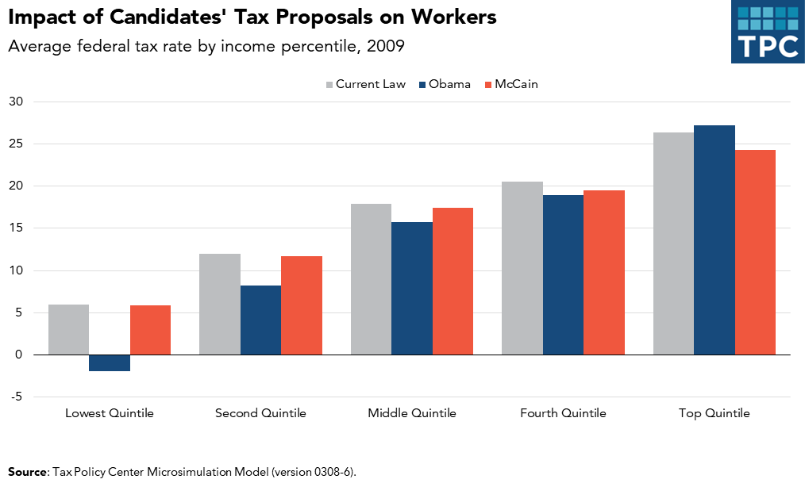

::: 

**Notes about this chart:**

- When dealing with political comparisons, lean on the identifiable colors of the parties. Red colors are generally associated with Republicans and blues are generally associated with Democrats
- When working on a chart that has political categories, be sure to use a nonpolitical color for baseline or unaffiliated series (in this case, "current law")

## Bar Charts

### When to Use a Bar Chart

- To show the trend in one variable, usually across a number of categories
- To show multiple variables with multiple bars (if they are on the same scale)
- To show the same variable for multiple observations with multiple lines

### Style Tips

- The y-axis should start at zero ([there are a few instances when it is okay](http://qz.com/418083/its-ok-not-to-start-your-y-axis-at-zero/))
- Axis labels should always be horizontal. If you have long labels, consider making a horizontal bar chart instead of a column chart
- When using a horizontal bar chart, right-align the category labels and center them vertically with respect to the bar
- Try to avoid vertical grid lines. Instead, directly label each bar

::: {.panel-tabset}

#### R

```{r bar-chart}
#| message: FALSE
#| warning: FALSE
#| fig-width: 10
#| fig-height: 10
#| fig-format: png
#| dpi: 300

library(ggplot2)
library(dplyr)
library(tpcthemes)

extrafont::loadfonts(device = "win", quiet = TRUE)

# create data frame
data <- data.frame(
  country = c("Denmark", "Sweden", "Belgium", "Italy", "France", "Finland", "Austria", "Norway", "Hungary", "Netherlands", "Slovenia", "Germany", "Iceland", "Czech Republic", "United Kingdom", "Luxembourg", "Portugal", "OECD-Total", "Poland", "Israel", "New Zealand", "Spain", "Greece", "Canada", "Slovak Republic", "Switzerland", "Ireland", "Japan", "Australia", "Korea", "United States", "Turkey", "Chile", "Mexico"),
  tax_rate = c(48, 46, 44, 43, 43, 43, 43, 43, 40, 39, 37, 37, 37, 36, 36, 36, 35, 35, 34, 34, 34, 33, 33, 32, 29, 29, 29, 28, 27, 27, 26, 24, 22, 21)
)

# Add a column to categorize each country
data$category <- ifelse(data$country == "United States", "United States",
                        ifelse(data$country == "OECD-Total", "OECD-Total", "Other"))

# Sort by tax_rate descending
data <- data[order(-data$tax_rate), ]
data$country <- factor(data$country, levels = data$country)

# Create chart
ggplot(data, aes(x = country, y = tax_rate, fill = category)) +
  geom_col() +
  scale_fill_manual(values = c("Other" = "#008bb0", 
                               "OECD-Total" = "#174a7c",
                               "United States" = "#F0573E")) +
  # add data labels to United States and OECD-Total bars only
  geom_text(data = subset(data, category %in% c("United States", "OECD-Total")),
            aes(label = paste0(tax_rate, "%")), 
            vjust = 0.5,
            hjust = -0.1, 
            family = "Avenir TPC",
            size = 3.5) +
  scale_y_continuous(limits = c(0, 50),
  expand = expansion(mult = c(0, 0.02), add = c(0, 0))) +
  tpc_theme() +
  labs(
    title = "United States Tax Burden Lags Behind Peer Countries",
    subtitle = "OECD Countries, 2008\n\nTaxes as a share of Gross Domestic Product",
    # instead of using the y axis label slot, you might prefer having a caption that explains the units of measurement. This allows you to remove the y-axis line and ticks for a cleaner look
    x = NULL,
    y = NULL,
    fill = NULL,
    caption = "Source: OECD Tax Statistics, 2010."
  ) +
  theme(axis.ticks.x = element_blank()) +
  coord_flip() + # flip coordinates to make it a horizontal bar chart
  theme(axis.text.y = element_text(margin = margin(r = 15)), # add some space between the y-axis labels and the bars after coord_flip
        legend.position = "none") 
```

#### Excel

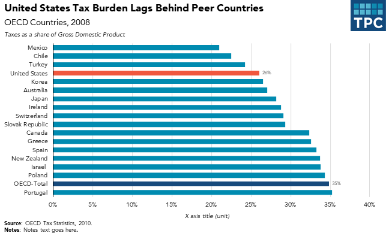

:::

**Notes about this chart:**

- United States is highlighted using the Poppy color
- OECD-Total is differentiated by using a darker shade of the primary bar color

## Area and Stacked Column Charts

### When to Use an Area Chart

- To show the trend in composition of a group over time
- To display the part-to-whole relationship of categories, as well as totals

### When to Use a Stacked Column Chart

- When you want to show the composition of groups, but the data is not in a continuous time series
- A 100 percent stacked area chart can be used when displaying composition over time

### Style Tips

- The y-axis should always start at zero
- When possible, directly label series. If they are too small, use a legend
- Avoid individual data labels
- In a single chart, try to keep the maximum number of categories to three or four
- Legends should be stretched across the top of the chart, or on the right, and the order should match the order in the chart
- Sequential series should be shaded from lightest to darkest for easy comparison

::: {.panel-tabset}

#### R

Option 1: Legend horizontal above the chart, with the order matching the order in the chart

```{r area-chart-2a}
#| message: FALSE
#| warning: FALSE
#| fig-width: 10
#| fig-height: 6
#| fig-format: png
#| dpi: 300
library(ggplot2)
library(dplyr)
library(tpcthemes)

extrafont::loadfonts(device = "win", quiet = TRUE)

# Create data frame
data <- data.frame(
  year = c(1975, 1976, 1977, 1978, 1979, 1980, 1981, 1982, 1983, 1984, 1985, 1986, 1987, 1988, 1989, 1990, 1991, 1992, 1993, 1994, 1995, 1996, 1997, 1998, 1999, 2000, 2001, 2002, 2003, 2004, 2005, 2006),
  EITC_refundable = c(3.37, 3.15, 2.93, 2.48, 3.87, 3.35, 2.83, 2.55, 2.61, 2.25, 2.81, 2.72, 5.20, 7.25, 7.54, 8.12, 12.11, 14.31, 16.78, 22.58, 27.55, 29.75, 30.64, 33.61, 33.40, 32.55, 33.06, 37.81, 37.27, 37.67, 38.67, 39.07),
  EITC_nonrefundable = c(1.31, 1.43, 0.82, 0.76, 1.82, 1.51, 1.41, 1.16, 1.02, 0.92, 1.10, 0.97, 0.82, 2.79, 3.18, 3.51, 4.33, 4.41, 4.90, 6.13, 6.78, 7.28, 7.53, 6.39, 5.20, 5.26, 4.93, 5.00, 5.09, 5.04, 5.10, 5.32),
  CTC_refundable = c(0, 0, 0, 0, 0, 0, 0, 0, 0, 0, 0, 0, 0, 0, 0, 0, 0, 0, 0, 0, 0, 0, 0, 0, 0.98, 1.14, 5.69, 7.19, 9.98, 15.42, 16.00, 16.25),
  CTC_nonrefundable = c(0, 0, 0, 0, 0, 0, 0, 0, 0, 0, 0, 0, 0, 0, 0, 0, 0, 0, 0, 0, 0, 0, 0, 18.73, 23.47, 23.05, 25.53, 24.12, 24.97, 34.47, 33.08, 31.74)
) %>%
  tidyr::pivot_longer(cols = -year, names_to = "series", values_to = "value") %>%
  mutate(series = stringr::str_replace_all(series, "_", " ")) %>%
  mutate(series = stringr::str_replace_all(series, "refundable", "refundable portion"))

# Create stacked area chart
ggplot(data, aes(x = year, y = value, fill = series)) +
  geom_area(position = "stack") +
  scale_fill_manual(values = c("EITC refundable portion" = "#008bb0",
                               "EITC nonrefundable portion" = "#b0d0db",
                               "CTC refundable portion" = "#bcbec0",
                               "CTC nonrefundable portion" = "#666666")) +
  scale_y_continuous(labels = scales::dollar,
                     breaks = seq(0,100,25),
                     expand = expansion(mult = c(0, 0.2))) +
  scale_x_continuous(breaks = seq(1975, 2006, 5),
                     expand = expansion(mult = c(0, 0))) +
  tpc_theme() +
  labs(
    title = "Growth of Refundable Credits Over Time",
    subtitle = "Refundable and non-refundable elements, 1975–2006 ($ billions)",
    x = NULL,
    y = NULL,
    fill = NULL,
    caption = "Source: Tax Policy Center"
  ) +
  theme(legend.position = "top")
```

Option 2: Legend vertical to the right of the chart, with the order matching the order in the chart

```{r area-chart-2b}
#| message: FALSE
#| warning: FALSE
#| fig-width: 10
#| fig-height: 6
#| fig-format: png
#| dpi: 300

library(ggplot2)
library(dplyr)
library(tpcthemes)
extrafont::loadfonts(device = "win", quiet = TRUE)

# create dataframe
data <- data.frame(
  year = c(1975, 1976, 1977, 1978, 1979, 1980, 1981, 1982, 1983, 1984, 1985, 1986, 1987, 1988, 1989, 1990, 1991, 1992, 1993, 1994, 1995, 1996, 1997, 1998, 1999, 2000, 2001, 2002, 2003, 2004, 2005, 2006),
  EITC_refundable = c(3.37, 3.15, 2.93, 2.48, 3.87, 3.35, 2.83, 2.55, 2.61, 2.25, 2.81, 2.72, 5.20, 7.25, 7.54, 8.12, 12.11, 14.31, 16.78, 22.58, 27.55, 29.75, 30.64, 33.61, 33.40, 32.55, 33.06, 37.81, 37.27, 37.67, 38.67, 39.07),
  EITC_nonrefundable = c(1.31, 1.43, 0.82, 0.76, 1.82, 1.51, 1.41, 1.16, 1.02, 0.92, 1.10, 0.97, 0.82, 2.79, 3.18, 3.51, 4.33, 4.41, 4.90, 6.13, 6.78, 7.28, 7.53, 6.39, 5.20, 5.26, 4.93, 5.00, 5.09, 5.04, 5.10, 5.32),
  CTC_refundable = c(0, 0, 0, 0, 0, 0, 0, 0, 0, 0, 0, 0, 0, 0, 0, 0, 0, 0, 0, 0, 0, 0, 0, 0, 0.98, 1.14, 5.69, 7.19, 9.98, 15.42, 16.00, 16.25),
  CTC_nonrefundable = c(0, 0, 0, 0, 0, 0, 0, 0, 0, 0, 0, 0, 0, 0, 0, 0, 0, 0, 0, 0, 0, 0, 0, 18.73, 23.47, 23.05, 25.53, 24.12, 24.97, 34.47, 33.08, 31.74)
) %>%
  tidyr::pivot_longer(cols = -year, names_to = "series", values_to = "value") %>%
  mutate(series = stringr::str_replace_all(series, "_", " ")) %>%
  mutate(series = stringr::str_replace_all(series, "refundable", "refundable portion"))

# Create stacked area chart
ggplot(data, aes(x = year, y = value, fill = series)) +
  geom_area(position = "stack") +
  scale_fill_manual(values = c("EITC refundable portion" = "#008bb0",
                               "EITC nonrefundable portion" = "#b0d0db",
                               "CTC refundable portion" = "#bcbec0",
                               "CTC nonrefundable portion" = "#666666")) +
  scale_y_continuous(labels = scales::dollar,
                      breaks = seq(0,100,25),
                     expand = expansion(mult = c(0, 0.2))) +
  scale_x_continuous(breaks = seq(1975, 2006, 5),
                     expand = expansion(mult = c(0, 0))) +
  tpc_theme() +
  labs(
    title = "Growth of Refundable Credits Over Time",
    subtitle = "Refundable and non-refundable elements, 1975–2006 ($ billions)",
    x = NULL,
    y = NULL,
    fill = NULL,
    caption = "Source: Tax Policy Center"
  ) +
  theme(legend.position = "right",
        legend.direction = "vertical")
```

#### Excel

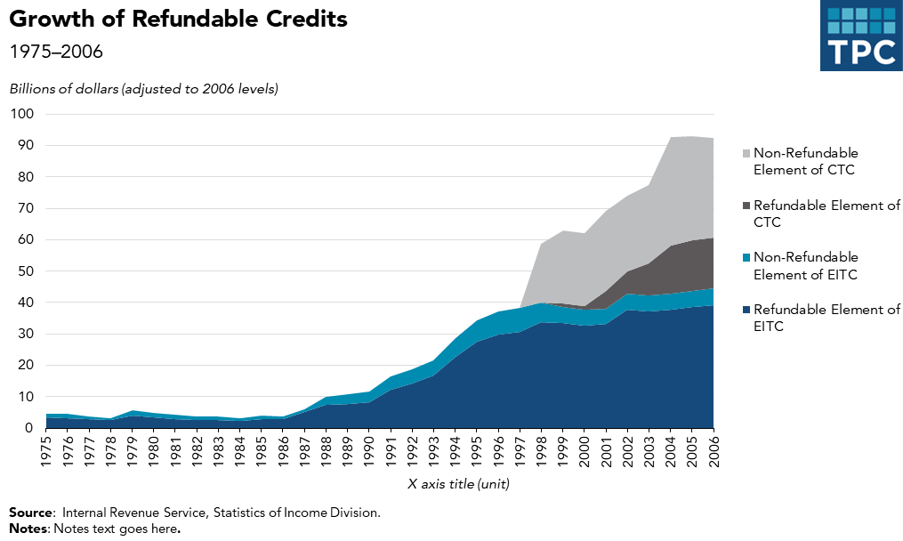

:::

**Notes about this chart:**

- This chart is an example of how to use two color families to tell a better story. Here, the CTC series are in shades of gray and the EITC series are in blues
- Instead of a key, there is enough room to directly label the series using text boxes. Coordinated text color also helps the user make the connection between the label and the series

::: {.panel-tabset}

#### R

```{r area-chart}
#| message: FALSE
#| warning: FALSE
#| fig-width: 10
#| fig-height: 6
#| fig-format: png
#| dpi: 300
library(ggplot2)
library(dplyr)
library(tidyr)
library(tpcthemes)

extrafont::loadfonts(device = "win", quiet = TRUE)

# Create data frame with simple names
data <- data.frame(
  year = 1962:2030,
  ss = c(2.5, 2.6, 2.5, 2.6, 2.6, 2.6, 2.8, 2.8, 3.1, 3.4, 3.4, 3.8, 4.0, 4.2, 4.2, 4.2, 4.1, 4.1, 4.4, 4.6, 4.9, 4.8, 4.5, 4.5, 4.5, 4.4, 4.3, 4.3, 4.3, 4.5, 4.6, 4.6, 4.5, 4.6, 4.5, 4.4, 4.3, 4.2, 4.2, 4.3, 4.4, 4.3, 4.2, 4.2, 4.2, 4.3, 4.3, 4.2, 4.3, 4.3, 4.4, 4.5, 4.5, 4.6, 4.7, 4.8, 4.9, 5.0, 5.1, 5.2, 5.4, 5.5, 5.6, 5.7, 5.8, 5.9, 6.0, 6.0, 6.1),
  medicare = c(0.0, 0.0, 0.0, 0.1, 0.3, 0.6, 0.8, 0.8, 0.9, 0.9, 1.0, 1.0, 1.1, 1.3, 1.4, 1.5, 1.5, 1.6, 1.7, 1.8, 2.0, 2.0, 2.0, 2.1, 2.1, 2.2, 2.2, 2.2, 2.4, 2.7, 3.0, 3.1, 3.3, 3.4, 3.5, 3.5, 3.4, 3.3, 3.3, 3.4, 3.6, 3.7, 3.8, 3.8, 4.0, 4.1, 4.2, 4.3, 4.5, 4.6, 4.7, 4.9, 5.0, 5.2, 5.4, 5.6, 5.7, 5.9, 6.1, 6.3, 6.5, 6.7, 6.9, 7.2, 7.4, 7.6, 7.9, 8.1, 8.3),
  other = c(14.8, 14.7, 14.0, 13.7, 14.4, 15.6, 15.1, 14.2, 14.1, 14.0, 13.4, 12.5, 13.5, 14.5, 14.1, 13.5, 13.2, 13.1, 13.9, 13.5, 13.9, 13.6, 12.8, 13.0, 12.6, 12.0, 11.7, 11.7, 11.9, 11.8, 11.2, 10.6, 10.1, 9.5, 9.1, 8.7, 8.6, 8.7, 8.7, 9.1, 10.0, 10.5, 10.5, 10.6, 10.3, 9.8, 9.8, 9.8, 9.8, 9.8, 9.9, 9.9, 9.9, 9.9, 9.9, 9.9, 9.9, 9.8, 9.8, 9.8, 9.8, 9.8, 9.8, 9.8, 9.8, 9.7, 9.7, 9.7, 9.8),
  revenues = c(17.6, 17.7, 17.3, 17.2, 17.8, 18.1, 18.7, 19.3, 18.3, 17.5, 17.7, 17.9, 18.1, 17.6, 17.9, 18.1, 18.1, 18.6, 19.3, 19.3, 18.9, 17.5, 17.4, 17.6, 17.7, 18.3, 18.2, 18.3, 17.9, 17.8, 17.5, 17.7, 18.1, 18.6, 19.0, 19.5, 20.0, 20.3, 20.6, 19.3, 17.5, 16.5, 16.6, 17.8, 18.4, 18.9, 18.9, 18.6, 18.4, 18.5, 18.4, 18.3, 18.3, 18.4, 18.5, 18.5, 18.5, 18.6, 18.6, 18.6, 18.6, 18.7, 18.6, 18.7, 18.7, 18.7, 18.8, 18.9, 18.9)
)
# Create spending data for stacked area
spending_data <- data %>%
  select(year, ss, medicare, other) %>%
  pivot_longer(cols = -year, names_to = "category", values_to = "value") %>%
  mutate(category = recode(category,
                           ss = "Social Security",
                           medicare = "Medicare/Medicaid",
                           other = "Other Spending"))
label_data <- data %>%
  mutate(ss_mid = ss / 2,
         medicare_mid = ss + medicare / 2,
         other_mid = ss + medicare + other / 2) %>%
  filter(year == 2030) %>%
  pivot_longer(cols = ends_with("_mid"), names_to = "category", values_to = "y_pos") %>%
  mutate(category = recode(category,
                           "ss_mid" = "Social Security",
                           "medicare_mid" = "Medicare/Medicaid",
                           "other_mid" = "Other Spending"),
         category = factor(category, levels = c("Social Security", "Medicare/Medicaid", "Other Spending")))

other_labels <- data.frame(
  labels = c("Actual","Projected"),
  xlabels = c(2004, 2010),
  ylabels = c(27, 27)
)

# Create stacked area chart with direct labels
ggplot() +
  geom_area(data = spending_data, aes(x = year, y = value, fill = category), position = "stack") +
  geom_line(data = data, aes(x = year, y = revenues), color = "#000000", size = 1) +
  geom_text(data = label_data, aes(x = year, y = y_pos, label = category),
          family = "Avenir TPC", size = 3.5, hjust = 0, vjust = 0.5) +
  geom_text(data = data %>% filter(year == 1997), # place the revenue label near the middle of the line so it doesn't overlap with other labels 
            aes(x = year, y = revenues, label = "Revenues"),
            family = "Avenir TPC", size = 3.5, hjust = -0.01, vjust = -2, color ="#000000") + 
            # shift label upward so it doesn't overlap with the line
  geom_vline(xintercept = 2007, color = "#bcbec0") + # add a vertical line to separate actuals from projections
  geom_text(data = other_labels, aes(x = xlabels, y = ylabels, label = labels),
            family = "Avenir TPC", size = 3.5, hjust = 0.5, color = "#bcbec0") +
  scale_fill_manual(values = c("Social Security" = "#3f4f56",
                               "Medicare/Medicaid" = "#f0573e",
                               "Other Spending" = "#b0d0db")) +
  scale_colour_manual(values = c("Social Security" = "#3f4f56",
                               "Medicare/Medicaid" = "#f0573e",
                               "Other Spending" = "#b0d0db",
                               "Revenues" = "#000000")) +                      
  scale_y_continuous(expand = expansion(mult = c(0, 0.1)),
                     breaks = seq(0, 30, 5)) +
  scale_x_continuous(expand = expansion(mult = c(0,0)),
                     limits = c(1962, 2030),
                     breaks = c(1962, seq(1965, 2030, 5))) + 
  coord_cartesian(clip = "off") + # allow labels to be placed outside of the plot area
  tpc_theme() +
  labs(
    title = "CBO Long-Term Federal Spending and Revenues Projections",
    subtitle = "Actual, 1962-2006 and projected, 2007-2030 (pessimistic scenario) as a percent of gross domestic product",
    x = NULL,
    y = NULL,
    caption = "Source: Congressional Budget Office"
  ) +
  theme(legend.position = "none",
        axis.text.y = element_text(margin = margin(r = 10)),
        plot.margin = unit(c(5.5, 100, 5.5, 5.5), "pt"))
```

#### Excel

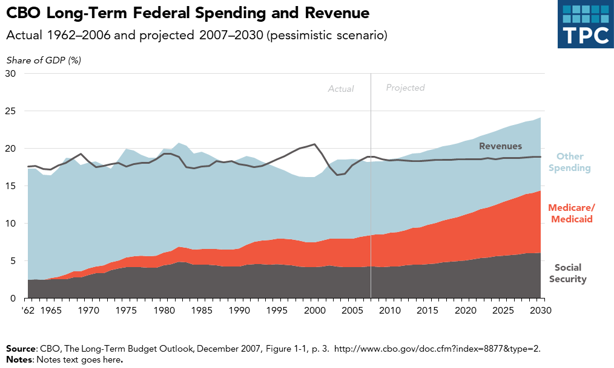

:::

**Notes about this chart:**

- X-axis labels should be every 5 or 10 years for time-series data like this, but the chart data starts at 1962. To hack this in Excel, a new column called "chart-year" was created with only the years to show. In R, this was done by setting `scale_x_continuous(breaks = c(1962, seq(1965, 2030, 5)))` in the code.
- It appears that the growth in Medicare and Medicaid spending is a big story in this chart. For that reason, the brightest color in the categorical palette was chosen for that series
- Contrast in typographic elements helps establish hierarchy

::: {.panel-tabset}

#### R

```{r area-chart-100-percent}
#| message: FALSE
#| warning: FALSE
#| fig-width: 10
#| fig-height: 6
#| fig-format: png
#| dpi: 300
library(ggplot2) 
library(dplyr)
library(tidyr)
library(tpcthemes)
extrafont::loadfonts(device = "win", quiet = TRUE)

# Revenue composition data
revenue_data <- data.frame(
  year = c(1950, 1951, 1952, 1953, 1954, 1955, 1956, 1957, 1958, 1959, 1960, 1961, 1962, 1963, 1964, 1965, 1966, 1967, 1968, 1969, 1970, 1971, 1972, 1973, 1974, 1975, 1976, 1977, 1978, 1979, 1980, 1981, 1982, 1983, 1984, 1985, 1986, 1987, 1988, 1989, 1990, 1991, 1992, 1993, 1994, 1995, 1996, 1997, 1998, 1999, 2000, 2001, 2002, 2003, 2004, 2005, 2006, 2007, 2008, 2009, 2010),
  individual = c(39.90, 41.90, 42.20, 42.80, 42.40, 43.90, 43.20, 44.50, 43.60, 46.30, 44.00, 43.80, 45.70, 44.70, 43.20, 41.80, 42.40, 41.30, 44.90, 46.70, 46.90, 46.10, 45.70, 44.70, 45.20, 43.90, 44.20, 44.30, 45.30, 47.00, 47.20, 47.70, 48.20, 48.10, 44.80, 45.60, 45.40, 46.00, 44.10, 45.00, 45.20, 44.30, 43.60, 44.20, 43.10, 43.70, 45.20, 46.70, 48.10, 48.10, 49.60, 49.90, 46.30, 44.50, 43.00, 43.10, 43.40, 45.30, 45.40, 43.50, 41.50),
  corporation = c(26.50, 27.30, 32.10, 30.50, 30.30, 27.30, 28.00, 26.50, 25.20, 21.80, 23.20, 22.20, 20.60, 20.30, 20.90, 21.80, 23.00, 22.80, 18.70, 19.60, 17.00, 14.30, 15.50, 15.70, 14.70, 14.60, 13.90, 15.40, 15.00, 14.20, 12.50, 10.20, 8.00, 6.20, 8.50, 8.40, 8.20, 9.80, 10.40, 10.40, 9.10, 9.30, 9.20, 10.20, 11.20, 11.60, 11.80, 11.50, 11.00, 10.10, 10.20, 7.60, 8.00, 7.40, 10.10, 12.90, 14.70, 14.40, 12.10, 6.60, 8.90),
  payroll = c(11.00, 11.00, 9.70, 9.80, 10.30, 12.00, 12.50, 12.50, 14.10, 14.80, 15.90, 17.40, 17.10, 18.60, 19.50, 19.00, 19.50, 21.90, 22.20, 20.90, 23.00, 25.30, 25.40, 27.30, 28.50, 30.30, 30.50, 29.90, 30.30, 30.00, 30.50, 30.50, 32.60, 34.80, 35.90, 36.10, 36.90, 35.50, 36.80, 36.30, 36.80, 37.50, 37.90, 37.10, 36.70, 35.80, 35.10, 34.20, 33.20, 33.50, 32.20, 34.90, 37.80, 40.00, 39.00, 36.90, 34.80, 33.90, 35.70, 42.30, 40.00),
  excise = c(19.10, 16.80, 13.40, 14.20, 14.30, 14.00, 13.30, 13.20, 13.40, 13.30, 12.60, 12.60, 12.60, 12.40, 12.20, 12.50, 10.00, 9.20, 9.20, 8.10, 8.10, 8.90, 7.50, 7.00, 6.40, 5.90, 5.70, 4.90, 4.60, 4.00, 4.70, 6.80, 5.90, 5.90, 5.60, 4.90, 4.30, 3.80, 3.90, 3.50, 3.40, 4.00, 4.20, 4.20, 4.40, 4.30, 3.70, 3.60, 3.30, 3.90, 3.40, 3.30, 3.60, 3.80, 3.70, 3.40, 3.10, 2.50, 2.70, 3.00, 3.10),
  other = c(3.40, 3.10, 2.60, 2.70, 2.70, 2.80, 3.00, 3.30, 3.70, 3.70, 4.20, 4.00, 4.00, 4.10, 4.20, 4.90, 5.10, 4.70, 5.00, 4.70, 4.90, 5.40, 6.00, 5.20, 5.20, 5.40, 5.80, 5.30, 4.80, 4.80, 5.10, 4.80, 5.30, 5.00, 5.20, 5.00, 5.20, 4.90, 4.80, 4.90, 5.40, 4.80, 5.10, 4.40, 4.60, 4.60, 4.20, 4.00, 4.40, 4.40, 4.50, 4.30, 4.30, 4.30, 4.20, 3.80, 4.00, 3.90, 4.20, 4.70, 6.50)
)

# Reshape for stacking
revenue_long <- revenue_data %>%
  pivot_longer(cols = -year, names_to = "category", values_to = "value") %>%
  mutate(category = recode(category,
                           individual = "Individual Income",
                           corporation = "Corporation Income",
                           payroll = "Payroll Taxes",
                           excise = "Excise Taxes",
                           other = "Other"),
         category = factor(category, levels = c("Individual Income", "Corporation Income", "Payroll Taxes", "Excise Taxes", "Other")))

# Create stacked area chart
ggplot(revenue_long, aes(x = year, y = value, fill = category)) +
  geom_area(position = "fill") +
  scale_fill_manual(values = c("Individual Income" = "#174a7c",
                               "Corporation Income" = "#f0573e",
                               "Payroll Taxes" = "#fcb64b",
                               "Excise Taxes" = "#008bb0",
                               "Other" = "#bcbec0")) +
  scale_x_continuous(expand = expansion(mult = c(0, 0)),
                     limits = c(1950, 2010),
                     breaks = seq(1950, 2010, 10)) +
  scale_y_continuous(expand = expansion(mult = c(0, 0.05)),
                     breaks = c(0, 0.2, 0.4, 0.6, 0.8, 1),  
                     labels = scales::percent_format()) +
  labs(
    title = "This is the Title and Highlights the Key Takeaway of the Chart",
    subtitle = "This is the subtitle and explains the chart",
    x = NULL,
    y = NULL,
    caption = "Source: Source information goes here."
  ) +
  tpc_theme() + 
  theme(legend.position = "right",
         legend.direction = "vertical",
         axis.text.y = element_text(family = "Avenir TPC", size = 10, margin = margin(r = 10)),
         plot.margin = unit(c(5.5,  5.5, 5.5, 10), "pt"))
```

#### Excel

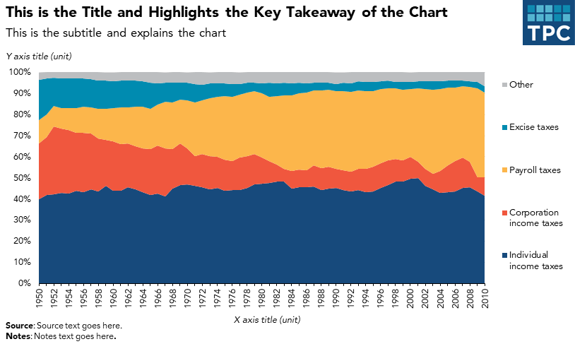

:::

**Notes about this chart:**

- In the excel example, the x-axis is starting to get a little cramped. To free up some space, consider labeling fewer years.
- The legend is positioned to the right of the chart in a vertical layout. The order matches the order of the data in the columns

### Case Study: Alternative to a Stacked Column Chart

Often, when you want to show composition across several dimensions (usually time), the default choice is a stacked column chart. Though this is not a bad chart type, often a story can be better told by using a different chart.

::: {.panel-tabset}

#### R

```{r stacked-column-categorical}
#| message: FALSE
#| warning: FALSE
#| fig-width: 10
#| fig-height: 6
#| fig-format: png
#| dpi: 300
library(ggplot2) 
library(dplyr)
library(tidyr)
library(tpcthemes)
extrafont::loadfonts(device = "win", quiet = TRUE)
 
# create dataframe
income_composition <- data.frame(
  income_bracket = c("$1 under $25,000",
                     "$25,000 under $50,000",
                     "$50,000 under $100,000", 
                     "$100,000 under $500,000",
                     "$500,000 under $1,000,000", 
                     "$1,000,000 under $5,000,000",
                     "$5,000,000 under $10,000,000", 
                     "$10,000,000 or more"),
  salaries_wages = c(0.73927727, 0.797819713, 0.758972984, 0.721077848, 0.531701787, 
                     0.376861355, 0.190789666, 0.159875141),
  interest_dividends = c(0.025533956, 0.01601004, 0.019287589, 0.029618833, 0.060802748, 
                         0.082941101, 0.132491659, 0.140969151),
  other = c(0.030099708, 0.020335165, 0.016116181, 0.021752209, 0.030421795, 
            0.038728583, 0.040360284, 0.040055732),
  retirement = c(0.11742145, 0.130528372, 0.166143997, 0.117725659, 0.042411385, 
                 0.031257655, 0.00960259, 0.006638),
  business_income = c(0.086598818, 0.032384335, 0.032981361, 0.083935307, 0.231632087, 
                      0.273865478, 0.184940527, 0.170038303),
  capital_gains = c(0.001068798, 0.002922375, 0.006497888, 0.025890144, 0.103030198, 
                    0.196345828, 0.441815275, 0.482423672)
) %>%
  tidyr::pivot_longer(cols = -income_bracket, names_to = "series", values_to = "value") %>%
  mutate(series = stringr::str_replace_all(series, "salaries_wages", "Salaries and wages"),
          series = stringr::str_replace_all(series, "interest_dividends", "Interest and dividends"),
          series = stringr::str_replace_all(series, "other", "Other"),
         series = stringr::str_replace_all(series, "retirement", "Retirement"),
         series = stringr::str_replace_all(series, "business_income", "Business income"),
         series = stringr::str_replace_all(series, "capital_gains", "Capital gains")) %>%
  mutate(series = factor(series, levels = c("Capital gains", "Business income", "Retirement", "Other", "Interest and dividends", "Salaries and wages"))) %>%
  mutate(income_bracket = factor(income_bracket, levels = c("$1 under $25,000", "$25,000 under $50,000", "$50,000 under $100,000", 
                     "$100,000 under $500,000", "$500,000 under $1,000,000", 
                     "$1,000,000 under $5,000,000", "$5,000,000 under $10,000,000", 
                     "$10,000,000 or more"))) %>%
  group_by(income_bracket) 


# dodged column chart
ggplot(income_composition) +
  geom_col(aes(x = income_bracket, y = value, fill = series), position = "stack") + 
  scale_y_continuous(labels = scales::percent_format(),
                     breaks = seq(0,1,0.25),
                     expand = expansion(mult = c(0, 0.05))) +
  labs(
    title = "This is the Title and Highlights the Key Takeaway of the Chart",
    subtitle = "This is the subtitle and explains the chart",
    x = NULL,
    y = NULL,
    caption = "Source: Source information goes here."
  ) +
  tpc_theme() + 
  theme(legend.position = "right",
        legend.direction = "vertical",
        axis.text.y = element_text(family = "Avenir TPC", size = 10, margin = margin(r=10)),
        plot.margin=unit(c(5.5,5.5,5.5,10), "pt")) +
  scale_fill_manual(values = c("Salaries and wages" = "#174a7c",
                               "Interest and dividends" = "#f0573e",
                               "Other" = "#fcb64b",
                               "Retirement" = "#008bb0",
                               "Business income" = "#bcbec0",
                               "Capital gains" = "#000000")) +
scale_x_discrete(expand = expansion(mult = c(0.01, 0.01)),
                  labels = function(x) stringr::str_wrap(x, width = 10)) 

```

#### Excel 

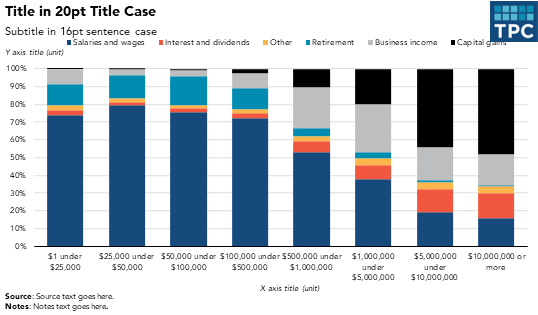

:::

**Notes about this chart:**

- It is hard to see change in the middle series because of the shifting height of the salaries and wages bars
- Because some series are too small to directly label them, a legend is necessary

**Grouped Column Chart Alternative**

::: {.panel-tabset}

#### R
```{r grouped-column-categorical}
#| message: FALSE
#| warning: FALSE
#| fig-width: 10
#| fig-height: 6
#| fig-format: png
#| dpi: 300
library(ggplot2) 
library(dplyr)
library(tidyr)
library(tpcthemes)
extrafont::loadfonts(device = "win", quiet = TRUE)
 
# create dataframe
income_composition <- data.frame(
  income_bracket = c("$1 under $25,000",
                     "$25,000 under $50,000",
                     "$50,000 under $100,000", 
                     "$100,000 under $500,000",
                     "$500,000 under $1,000,000", 
                     "$1,000,000 under $5,000,000",
                     "$5,000,000 under $10,000,000", 
                     "$10,000,000 or more"),
  salaries_wages = c(0.73927727, 0.797819713, 0.758972984, 0.721077848, 0.531701787, 
                     0.376861355, 0.190789666, 0.159875141),
  interest_dividends = c(0.025533956, 0.01601004, 0.019287589, 0.029618833, 0.060802748, 
                         0.082941101, 0.132491659, 0.140969151),
  other = c(0.030099708, 0.020335165, 0.016116181, 0.021752209, 0.030421795, 
            0.038728583, 0.040360284, 0.040055732),
  retirement = c(0.11742145, 0.130528372, 0.166143997, 0.117725659, 0.042411385, 
                 0.031257655, 0.00960259, 0.006638),
  business_income = c(0.086598818, 0.032384335, 0.032981361, 0.083935307, 0.231632087, 
                      0.273865478, 0.184940527, 0.170038303),
  capital_gains = c(0.001068798, 0.002922375, 0.006497888, 0.025890144, 0.103030198, 
                    0.196345828, 0.441815275, 0.482423672)
) %>%
  tidyr::pivot_longer(cols = -income_bracket, names_to = "series", values_to = "value") %>%
  mutate(series = stringr::str_replace_all(series, "salaries_wages", "Salaries and wages"),
          series = stringr::str_replace_all(series, "interest_dividends", "Interest and dividends"),
          series = stringr::str_replace_all(series, "other", "Other"),
         series = stringr::str_replace_all(series, "retirement", "Retirement"),
         series = stringr::str_replace_all(series, "business_income", "Business income"),
         series = stringr::str_replace_all(series, "capital_gains", "Capital gains")) %>%
  mutate(series = factor(series, levels = c("Salaries and wages", "Interest and dividends", "Other", "Retirement", "Business income", "Capital gains")),
         income_bracket = factor(income_bracket, levels = c("$1 under $25,000", "$25,000 under $50,000", "$50,000 under $100,000", 
                     "$100,000 under $500,000", "$500,000 under $1,000,000", 
                     "$1,000,000 under $5,000,000", "$5,000,000 under $10,000,000", 
                     "$10,000,000 or more"))) %>%
  group_by(income_bracket) 


# dodged column chart
ggplot(income_composition) +
  geom_col(aes(x = income_bracket, y = value, fill = series), position = "dodge") + 
  scale_y_continuous(labels = scales::percent_format(),
                     breaks = seq(0,1,0.25),
                     expand = expansion(mult = c(0, 0.05))) +
  labs(
    title = "This is the Title and Highlights the Key Takeaway of the Chart",
    subtitle = "This is the subtitle and explains the chart",
    x = NULL,
    y = NULL,
    caption = "Source: Source information goes here."
  ) +
  tpc_theme() + 
 theme(axis.text.y = element_text(family = "Avenir TPC", size = 10, margin = margin(r=10)),
        plot.margin=unit(c(5.5,5.5,5.5,10), "pt")) +
  scale_fill_manual(values = c("Salaries and wages" = "#174a7c",
                               "Interest and dividends" = "#f0573e",
                               "Other" = "#fcb64b",
                               "Retirement" = "#008bb0",
                               "Business income" = "#bcbec0",
                               "Capital gains" = "#000000")) +
  scale_x_discrete(expand = expansion(mult = c(0.01, 0.01)),
                  labels = function(x) stringr::str_wrap(x, width = 10)) 
```

#### Excel

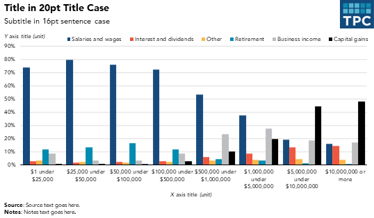

:::

**Notes about this chart:**

- This version makes it easier to see the change in individual series across categories
- It is also easier to compare series within the same category, allowing a better visual understanding of the part-to-whole relationship

### Small Multiples Area Charts

::: {.panel-tabset}

#### R

```{r area-multiples}
#| message: FALSE
#| warning: FALSE
#| fig-width: 10
#| fig-height: 6
#| fig-format: png
#| dpi: 300
library(ggplot2) 
library(dplyr)
library(tidyr)
library(tpcthemes)
extrafont::loadfonts(device = "win", quiet = TRUE)
 
# create dataframe
income_composition <- data.frame(
  income_bracket = c("$1 under $25,000",
                     "$25,000 under $50,000",
                     "$50,000 under $100,000", 
                     "$100,000 under $500,000",
                     "$500,000 under $1,000,000", 
                     "$1,000,000 under $5,000,000",
                     "$5,000,000 under $10,000,000", 
                     "$10,000,000 or more"),
  salaries_wages = c(0.73927727, 0.797819713, 0.758972984, 0.721077848, 0.531701787, 
                     0.376861355, 0.190789666, 0.159875141),
  interest_dividends = c(0.025533956, 0.01601004, 0.019287589, 0.029618833, 0.060802748, 
                         0.082941101, 0.132491659, 0.140969151),
  other = c(0.030099708, 0.020335165, 0.016116181, 0.021752209, 0.030421795, 
            0.038728583, 0.040360284, 0.040055732),
  retirement = c(0.11742145, 0.130528372, 0.166143997, 0.117725659, 0.042411385, 
                 0.031257655, 0.00960259, 0.006638),
  business_income = c(0.086598818, 0.032384335, 0.032981361, 0.083935307, 0.231632087, 
                      0.273865478, 0.184940527, 0.170038303),
  capital_gains = c(0.001068798, 0.002922375, 0.006497888, 0.025890144, 0.103030198, 
                    0.196345828, 0.441815275, 0.482423672)
) %>%
  tidyr::pivot_longer(cols = -income_bracket, names_to = "series", values_to = "value") %>%
  mutate(series = stringr::str_replace_all(series, "salaries_wages", "Salaries and wages"),
          series = stringr::str_replace_all(series, "interest_dividends", "Interest and dividends"),
          series = stringr::str_replace_all(series, "other", "Other"),
         series = stringr::str_replace_all(series, "retirement", "Retirement"),
         series = stringr::str_replace_all(series, "business_income", "Business income"),
         series = stringr::str_replace_all(series, "capital_gains", "Capital gains")) %>%
  mutate(series = factor(series, levels = c("Salaries and wages", "Interest and dividends", "Other", "Retirement", "Business income", "Capital gains")),
         income_bracket = factor(income_bracket, levels = c("$1 under $25,000", "$25,000 under $50,000", "$50,000 under $100,000", 
                     "$100,000 under $500,000", "$500,000 under $1,000,000", 
                     "$1,000,000 under $5,000,000", "$5,000,000 under $10,000,000", 
                     "$10,000,000 or more")))

# small multiples area charts
ggplot(income_composition) +
  geom_col(aes(x = income_bracket, y = value, fill = series)) + 
  facet_wrap(~series, nrow = 1,
             labeller = label_wrap_gen(width = 10)) + 
  scale_y_continuous(labels = scales::percent_format(),
                      breaks = seq(0,1,0.25),
                      limits = c(0,1),
                     expand = expansion(mult = c(0, 0.05))) +
  labs(
    title = "This is the Title and Highlights the Key Takeaway of the Chart",
    subtitle = "This is the subtitle and explains the chart",
    x = NULL,
    y = NULL,
    caption = "Source: Source information goes here."
  ) +
  tpc_theme() + 
  scale_fill_manual(values = c("Salaries and wages" = "#174a7c",
                               "Interest and dividends" = "#f0573e",
                               "Other" = "#fcb64b",
                               "Retirement" = "#008bb0",
                               "Business income" = "#bcbec0",
                               "Capital gains" = "#000000")) +
  scale_x_discrete(labels = c("$0-25K", "$25-50K", "$50-100K", "$100-500K", "$500K-1M", "$1M-5M", "$5M-10M", "$10M+")) +
  theme(axis.text.x = element_text(angle = 90, hjust = 1, vjust = 0.5))

```

Rather than use an area chart, we want to use a column chart to demonstrate that these are discrete categories rather than continuous points on the x-axis.

#### Excel 

Contrast this with Excel, where it's possible to make area charts using discrete x-values. However, a bar chart is still better (shown below).

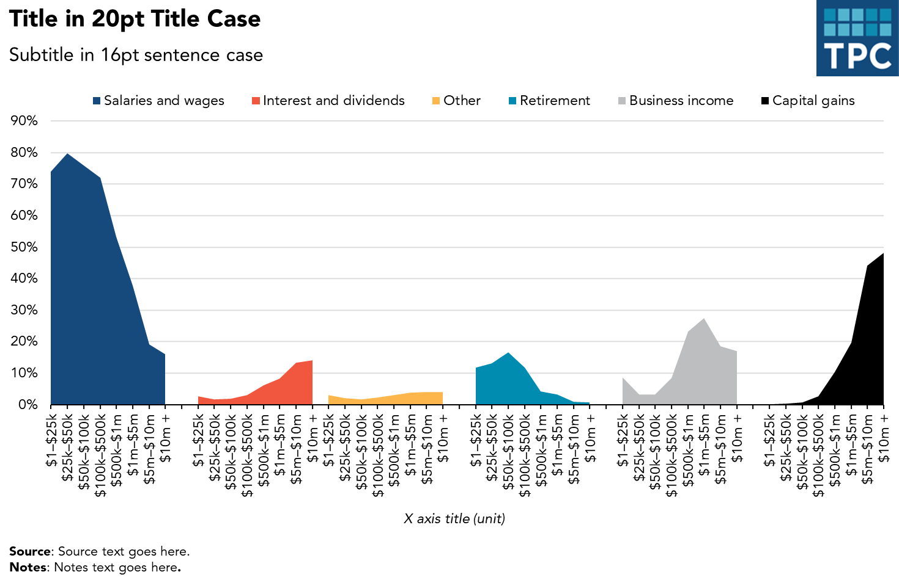
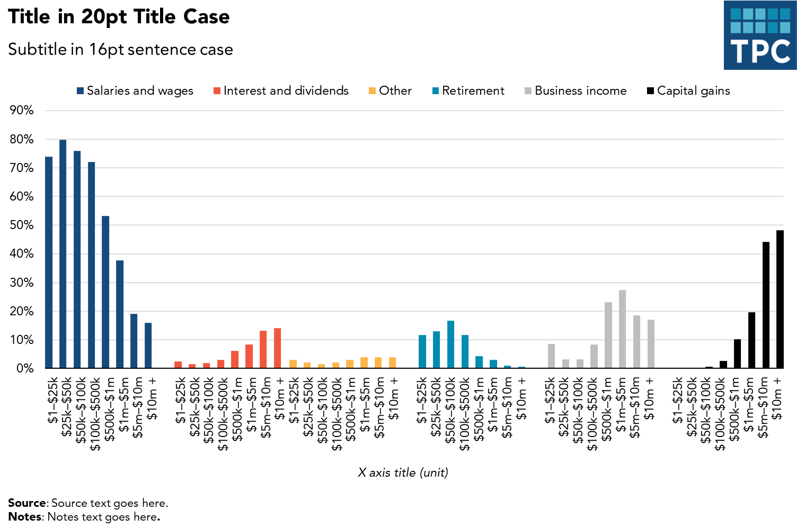

:::

**Notes about this chart:**
- If the story for this chart is about the distribution of any given series, small multiple area charts are the way to go
- For example, it's easy to see that the lower-earning groups get most of their income from salary, whereas the highest-earners get more from capital gains
- The colors here are unnecessary—there's no need to code the data by color because they're all separate. However, the contrast the colors give each category is visually appealing

## Line Charts

### When to Use a Line Chart

- To show the trend in one variable, usually over time
- To show multiple variables with multiple lines (if they are on the same scale)
- To show the same variable for multiple observations with multiple lines

### Style Tips

- The y-axis should always start at zero
- When possible, directly label series. If too close together, use a legend
- Avoid individual data markers
- Avoid dashed lines
- In a single chart, try to keep the maximum number of lines to three or four
- Legends should be stretched across the top of the chart and the order should match the order in the chart
- Sequential series should be shaded from lightest to darkest for easy comparison

::: {.panel-tabset}

#### R

```{r line-chart}
#| message: FALSE
#| warning: FALSE
#| fig-width: 10
#| fig-height: 6
#| fig-format: png
#| dpi: 300
library(dplyr)
library(ggplot2)
library(tpcthemes)
extrafont::loadfonts(device = "win", quiet = TRUE)
# create example data
data <- data.frame(
  year = c(1998, 1999, 2000, 2001, 2002, 2003, 2004, 2005, 2006, 2007, 2008, 2009, 2010, 2011, 2012, 2013, 2014),
  series1 = c(9991081, 10622794, 10116952, 10821819, 11240815, 11425090, 11533235, 11237238, 11213184, 10991496, 11145436, 11602000, 11979290, 11740265, 11234147, 10429316, 10365372),
  series2 = c(5311411, 5402864, 5457793, 5491464, 5710759, 5890821, 2540889, 2494145, 2453741, 2507728, 2537825, 2475785, 2355803, 2312909, 2262961, 2247747, 6698800)
)  


ggplot(data, aes(x = year)) +
  geom_line(aes(y = series1, color = "Series 1"), size = 1.5) +
  geom_line(aes(y = series2, color = "Series 2"), size = 1.5) +
  scale_color_manual(values = c("Series 1" = "#174a7c", "Series 2" = "#f0573e")) +
  tpc_theme() +
  labs(title = "Title in 20pt Title Case",
       subtitle = "Subtitle in 16pt sentence case",
       y = NULL,
       x = NULL,
       caption = "Source: Source here in sentence case.") +
  scale_y_continuous(labels = scales::comma_format()) +
  scale_x_continuous(breaks = seq(1998, 2014, 1)) +
  theme(legend.position = "top",
        legend.direction = "horizontal",
        legend.title = element_blank(),
        legend.text = element_text(family = "Avenir TPC", size = 10),
        axis.text.y = element_text(family = "Avenir TPC", size = 10, margin = margin(r=10)),
        plot.margin=unit(c(5.5,5.5,5.5,10), "pt"))

```

in this code chunk we use the same sample data but format it "long" so that series1 and series2 are not their own columns - instead all values go in one column and their series is identified with another column (see `color = series` in the `geom_line` and `geom_text` commands). We also label each line directly instead of using a legend, see `geom_text()` and `theme()`. Feel free to mix and match elements from both 
```{r line-chart-long}
#| message: FALSE
#| warning: FALSE
#| fig-width: 10
#| fig-height: 6
#| fig-format: png
#| dpi: 300
library(dplyr)
library(ggplot2)
library(tpcthemes)
extrafont::loadfonts(device = "win", quiet = TRUE)
# create example data
data <- data.frame(
  year = c(1998, 1999, 2000, 2001, 2002, 2003, 2004, 2005, 2006, 2007, 2008, 2009, 2010, 2011, 2012, 2013, 2014),
  series1 = c(9991081, 10622794, 10116952, 10821819, 11240815, 11425090, 11533235, 11237238, 11213184, 10991496, 11145436, 11602000, 11979290, 11740265, 11234147, 10429316, 10365372),
  series2 = c(5311411, 5402864, 5457793, 5491464, 5710759, 5890821, 2540889, 2494145, 2453741, 2507728, 2537825, 2475785, 2355803, 2312909, 2262961, 2247747, 6698800)
)  %>%
  tidyr::pivot_longer(cols = c(series1, series2), names_to = "series", values_to = "value") %>%
  mutate(series = recode(series, series1 = "Series 1", series2 = "Series 2"))


ggplot(data, aes(x = year)) +
  geom_line(aes(y = value, color = series), size = 1.5) +
  geom_text(data = data %>% filter(year == max(year)), 
            aes(y = value, label = series, color = series),
            hjust = -0.1, vjust = 0.5,
            family = "Avenir TPC", size = 3.5) +
  scale_color_manual(values = c("Series 1" = "#174a7c", "Series 2" = "#f0573e")) +
  tpc_theme() +
  labs(title = "Title in 20pt Title Case",
       subtitle = "Subtitle in 16pt sentence case",
       y = NULL,
       x = NULL,
       caption = "Source: Source here in sentence case.") +
  scale_y_continuous(labels = scales::comma_format()) +
  scale_x_continuous(breaks = seq(1998, 2014, 1),
                     expand = expansion(mult = c(0, 0.15))) +
  theme(legend.position = "none",
        # legend.title = element_blank(),
        legend.text = element_text(family = "Avenir TPC", size = 10),
        axis.text.y = element_text(family = "Avenir TPC", size = 10, margin = margin(r=10)),
        plot.margin=unit(c(5.5,5.5,5.5,10), "pt"))
```

#### Excel  

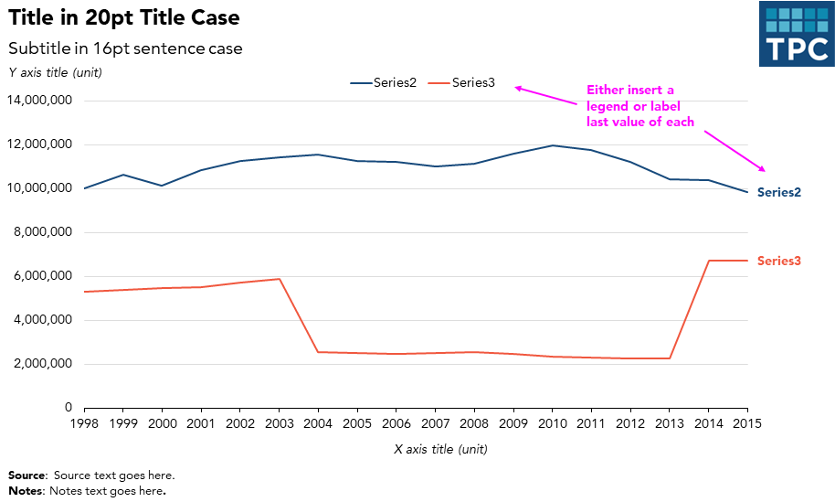

:::

**Notes about this chart:**
- Supposing the data in this chart is categorical, two contrasting colors are used. If the data were sequential, two shades of teal would be used
- The x-axis is starting to get a little cramped. To free up some space, reduce the number of labels or change the year format

::: {.panel-tabset}

#### R

```{r line}
#| message: FALSE
#| warning: FALSE
#| fig-width: 10
#| fig-height: 6
#| fig-format: png
#| dpi: 300
library(dplyr)
library(ggplot2)
library(tpcthemes)

extrafont::loadfonts(device = "win", quiet = TRUE)

# dataset
data <- data.frame(
  year = c(1976, 1980, 1985, 1990, 1995, 2001, 2006),
  value = c(4.2, 4.7, 6.4, 4.6, 5.4, 6.5, 5.7)
)

# line graph with points
ggplot(data, aes(x = year, y = value)) +
  geom_line(color = "#174a7c") +
  geom_point(color = "#174a7c") +
  tpc_theme() +
  labs(title = "Title in 20pt Title Case",
       subtitle = "Subtitle in 16pt subtitle case",
       x = NULL,
       y = NULL,
       caption = "Source: Source here.") +
  scale_y_continuous(breaks = seq(0,7,1), limits = c(0,7), expand = expansion(mult = c(0,0))) + 
  scale_x_continuous(breaks = data$year)
```

#### Excel  

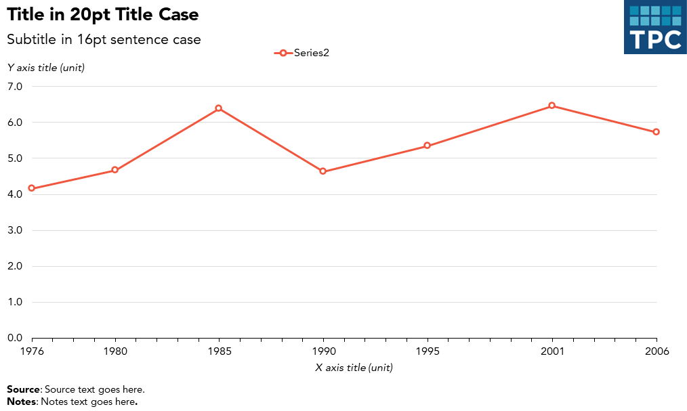

:::

**Notes about this chart:**

- Sometimes, we need to display data that are not on regular intervals. In these cases, it is helpful to mark the data points with individual markers

## Pie and Distribution Charts

### When to Use a Pie Chart

- Use them sparingly. Often a bar or column chart is better
- Use pie charts when you want to show the relative relationship between two or three things
- When they add up to 100 percent

### On the Use of Pie Charts

::::: {.callout-warning}
## Cautions about Pie Charts

*(Excerpted from Jon Schwabish's [An Economist's Guide to Visualizing Data](http://pubs.aeaweb.org/doi/pdfplus/10.1257/jep.28.1.209))*

The debate concerning the effectiveness of pie charts is among the most contentious in the field of data visualization. Many people love pie charts—they are familiar, easily understood, and present "part-to-whole" relationships in an obvious way. However, others argue that because pie charts force readers to make comparisons using the areas of the slices or the angles formed by the slices—something that our visual perception does not accurately support—they are not an effective way to communicate information.

Pie chart slices that form 90-degree right angles—that is, slices that form one-quarter increments—are the most familiar to our eyes. Other amounts are more difficult to discern. For that reason, a column or bar chart is preferable in most cases.

The current thinking is pretty much summed up by this quote from data visualization pioneer Edward Tufte: *"Pie chart users deserve same suspicion+skepticism as those who mix up its/it's, there/their. To compare, use little table, sentence, not pies."*

That's not to say that pie charts don't have a place when communicating research. They're OK to use when the number of slices are fewer than four or five—and when you're trying to tell a clear 'part-to-whole' story about a single slice.

**Related Research:**

- [Save the Pies for Desert](http://www.perceptualedge.com/articles/visual_business_intelligence/save_the_pies_for_dessert.pdf), Stephen Few
- [An Economist's Guide to Visualizing Data](http://pubs.aeaweb.org/doi/pdfplus/10.1257/jep.28.1.209), Jon Schwabish
- [Pie Charts are the Worst](http://www.businessinsider.com/pie-charts-are-the-worst-2013-6), Walter Hickey
- [Graphical Perception: Theory, Experimentation, and Application to the Development of Graphical Methods](http://www.jstor.org/stable/2288400?seq=15#page_scan_tab_contents), William S. Cleveland and Robert McGill
:::::

### Pie Chart Examples

::: {.panel-tabset}

#### R

```{r pie}
#| message: FALSE
#| warning: FALSE
#| fig-width: 6
#| fig-height: 6
#| fig-format: png
#| dpi: 300

library(ggplot2)
library(dplyr)
library(tpcthemes)

extrafont::loadfonts(device = "win", quiet = TRUE)

# create example data

piedata <- data.frame(
  series = c("Defense","Domestic","International"),
  value = c(688955,621410,40527)
) %>%
mutate(
  share = value/sum(value)
) 

# pie chart with each slice labeled

ggplot(piedata, aes(x = "", y = value)) +
  geom_bar(stat = "identity", width = 1, color = "white", size = 1, fill = "#008bb0") +
  coord_polar("y", start = 0, clip = "off") +
  geom_text(data = piedata %>% mutate(
              csum = cumsum(value) - value/2,
              x_pos = case_when(  
                series == "Defense" ~ 1.5,
                series == "Domestic" ~ 1.8,
                series == "International" ~ 1.6
              )),
            aes(x = x_pos, y = csum, label = paste0(series, " (", scales::percent(share), ")")), 
            family = "Avenir TPC", size = 3.5,
            hjust = 0) +
  tpc_theme() + 
  labs(title = "Title in 20pt Title Case",
       subtitle = "Subtitle in 16pt sentence case",
       x = NULL,
       y = NULL,
       caption = "Source: Source here in sentence case.") +
  theme(legend.position = "none",
        axis.line = element_blank(),
        axis.text = element_blank(),
        plot.margin = margin(l = -50, unit = "pt"))

```

#### Excel  

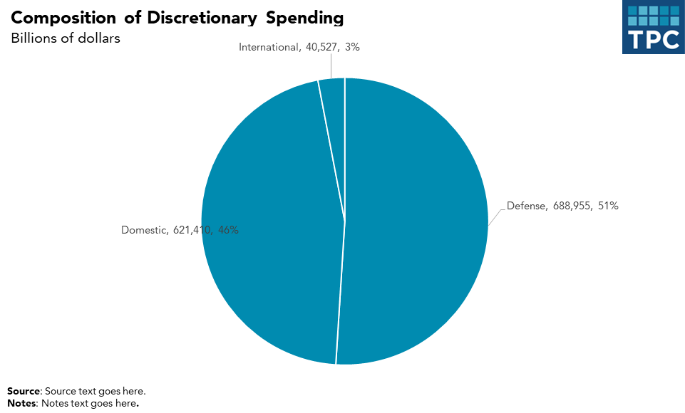

:::

**Notes about this chart:**

- Some times, pie charts are useful. In this case, the largest slice is 51%, a value that is very easy to recognize because our eyes can easily find the 50% mark
- Pie charts work extremely well when they have fewer than four or five slices
- It's helpful to directly label each slice. Relying on a key requires the reader to do too much work
- With only a few colors and direct labels, extra colors become distracting

::: {.panel-tabset}

#### R


```{r pie-alternative}
#| message: FALSE
#| warning: FALSE
#| fig-width: 10
#| fig-height: 6
#| fig-format: png
#| dpi: 300

library(ggplot2)
library(dplyr)
library(tpcthemes)

extrafont::loadfonts(device = "win", quiet = TRUE)

# create example data

piedata <- data.frame(
  series = c("Defense","Domestic","International"),
  value = c(688955,621410,40527)
) %>%
mutate(
  share = value/sum(value)
) 

# bar chart alternative to pie chart with each bar labeled with $
ggplot(piedata, aes(x = series, y = value)) +
  geom_col(color = "white", size = 1, fill = "#174a7c", position = "dodge") +
  geom_text(aes(label =  scales::comma(value)), 
            family = "Avenir TPC", size = 3.5,
            hjust = 0.5, vjust = -0.5) +
  tpc_theme() + 
  scale_y_continuous(expand = expansion(mult = c(0, 0.1)),
                     labels = scales::comma) +
  labs(title = "Title in 20pt Title Case",
       subtitle = "Subtitle in 16pt sentence case",
       x = NULL,
       y = NULL,
       caption = "Source: Source here in sentence case.") +
  theme(legend.position = "none")

```

#### Excel  

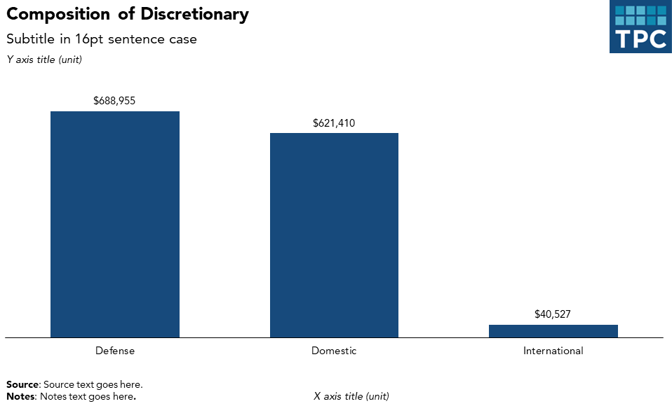

:::

::: {.panel-tabset}

#### R

```{r pie-many}
#| message: FALSE
#| warning: FALSE 
#| fig-width: 8
#| fig-height: 8
#| fig-format: png
#| dpi: 300

income_data <- data.frame(
  category = c("Capital gains", "Business income", "Salaries and wages", "Interest and dividends", "Other", "Retirement"),
  value = c(0.48, 0.17, 0.16, 0.14, 0.04, 0.01)
) %>%
mutate(category = factor(category, 
       levels = c("Capital gains", "Business income", "Salaries and wages", "Interest and dividends", "Other", "Retirement"))) %>%
arrange(desc(value))

# first make a pie chart with salaries and wages highlighted
ggplot(income_data, aes(x = "", y = value, fill = category)) +
  geom_bar(stat = "identity", width = 1, color = "white") +
  coord_polar("y", start = 0, clip = "off") +
  scale_y_reverse() + 
  scale_fill_manual(values = c("Capital gains" = "#174a7c",
                                "Business income" = "#174a7c",
                               "Salaries and wages" = "#b0d0db",
                               "Interest and dividends" = "#174a7c",
                               "Other" = "#174a7c",
                               "Retirement" = "#174a7c")) +
  geom_text(data = income_data %>%
            mutate(csum = sum(value) - cumsum(value) + value/2,
                    label = stringr::str_wrap(paste(category, " (", scales::percent(value), ")"), width = 10)) %>%
             mutate(csum = case_when(category == "Other" ~ csum + 0.02, 
             category == "Interest and dividends" ~ csum + 0.02,
             .default = csum)),
         aes(x = 1.7, y = csum, label = label), 
         hjust = 0, vjust = 0.5,
         family = "Avenir TPC", size = 3.5) +
  tpc_theme() +
  labs(title = "Title in 20pt Title Case",
       subtitle = "Subtitle in 16pt sentence case",
       x = NULL,  
       y = NULL,
       caption = "Source: Source here in sentence case.") +
  theme(legend.position = "none",
        axis.line = element_blank(),
        axis.text = element_blank(),
        plot.margin = margin(l = -50, unit = "pt"))

```

#### Excel  

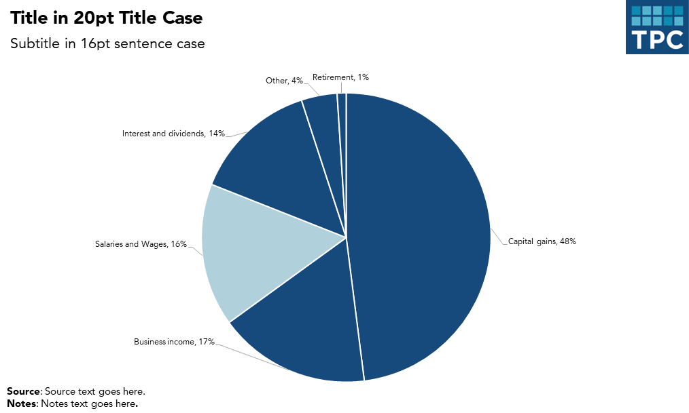

:::

**Notes about this chart:**

- This pie chart has many more slices than the first example, however it's still fairly easy to make out the individual slices
- Depending on the purpose of the chart, a histogram may be a better option

::: {.panel-tabset}

#### R

```{r pie-many-alternative}
#| message: FALSE
#| warning: FALSE
#| fig-width: 10
#| fig-height: 6
#| fig-format: png
#| dpi: 300
library(dplyr)
library(ggplot2)
library(tpcthemes)

extrafont::loadfonts(device = "win", quiet = TRUE)

income_data <- data.frame(
  category = c("Capital gains", "Business income", "Salaries and wages", "Interest and dividends", "Other", "Retirement"),
  value = c(0.48, 0.17, 0.16, 0.14, 0.04, 0.01)
) %>%
mutate(category = factor(category, 
       levels = c("Capital gains", "Business income", "Salaries and wages", "Interest and dividends", "Other", "Retirement"))) %>%
arrange(desc(value))

# col chart alternative to pie chart, still with salaries and wages in light blue
ggplot(income_data, aes(x = category, y = value, fill = category)) + 
  geom_col() +
  scale_fill_manual(values = c("Capital gains" = "#174a7c",
                                "Business income" = "#174a7c",
                               "Salaries and wages" = "#b0d0db",
                               "Interest and dividends" = "#174a7c",
                               "Other" = "#174a7c",
                               "Retirement" = "#174a7c")) +
  geom_text(aes(label = scales::percent(value)),
            family = "Avenir TPC", size = 3.5,
            hjust = 0.5, vjust = -0.5) +
  tpc_theme() +
  scale_y_continuous(labels = NULL, expand = expansion(mult = c(0, 0.05))) +
  labs(title = "Title in 20pt Title Case",
       subtitle = "Subtitle in 16pt sentence case",
       x = NULL,  
       y = NULL,
       caption = "Source: Source here in sentence case.") +
  theme(legend.position = "none")
```

#### Excel  

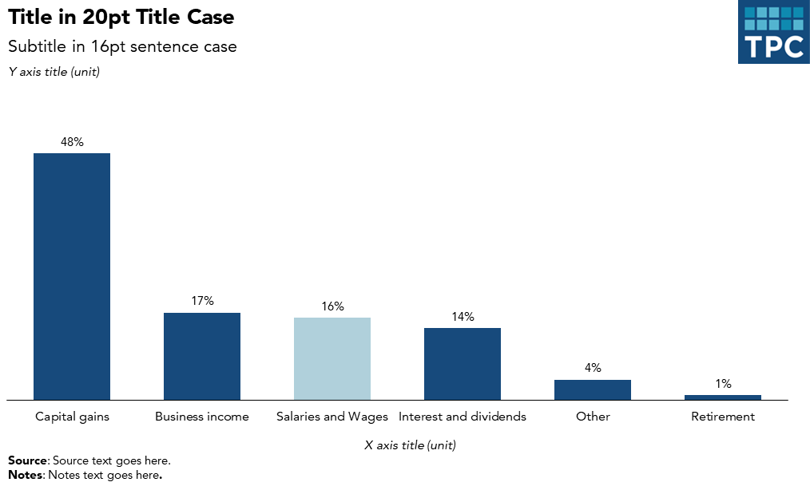

:::

