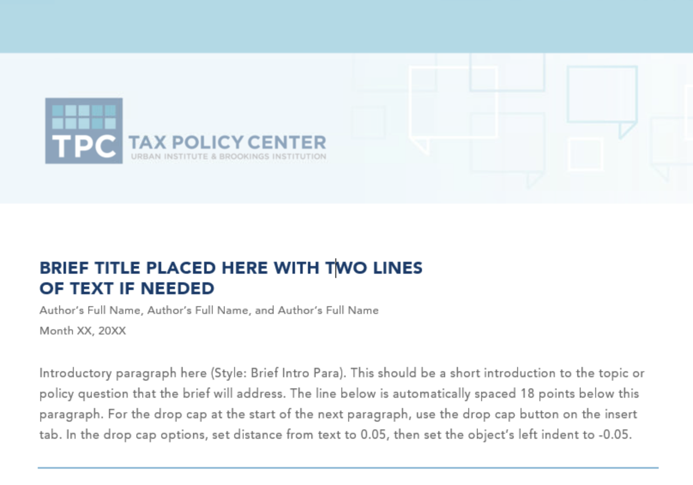
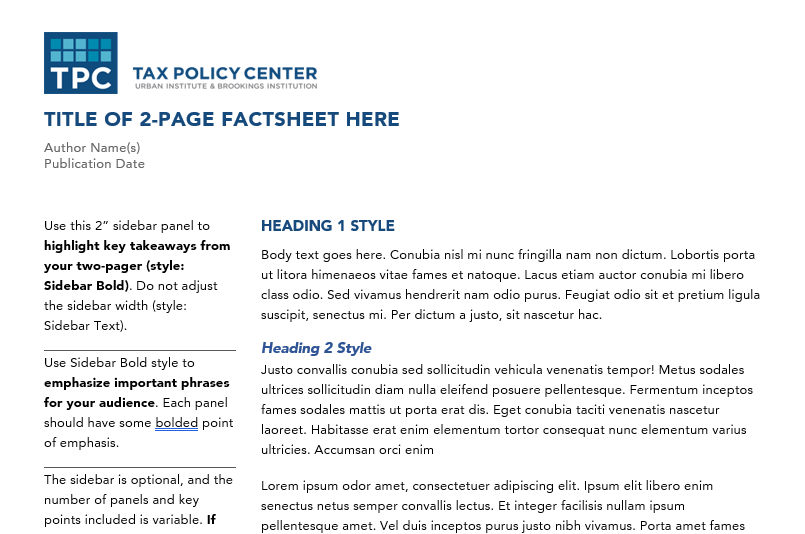
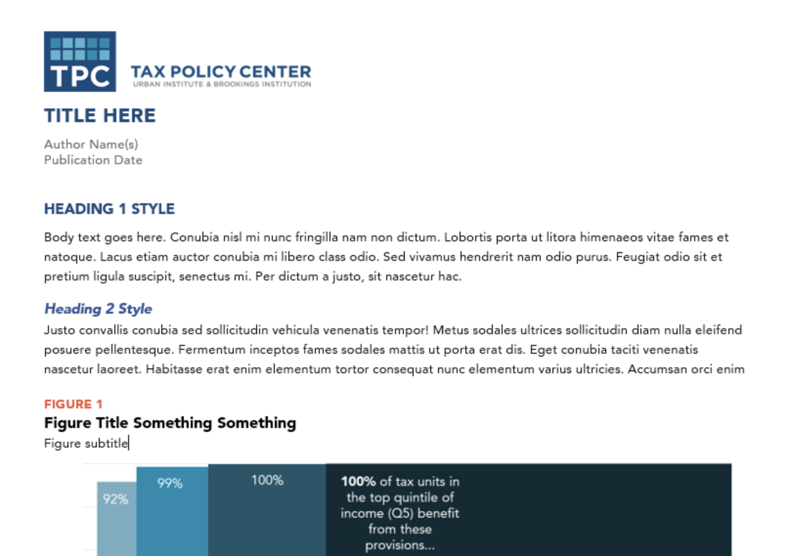
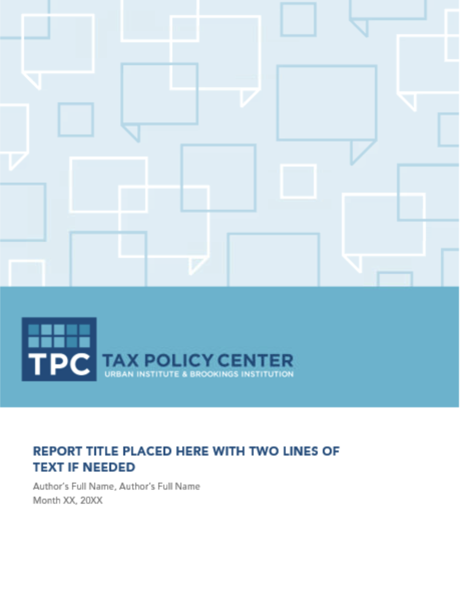
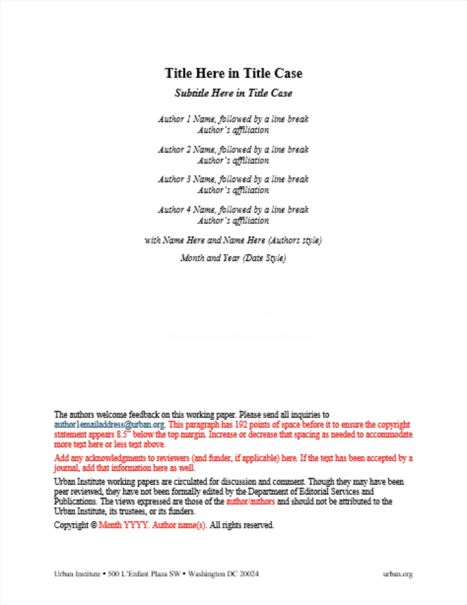
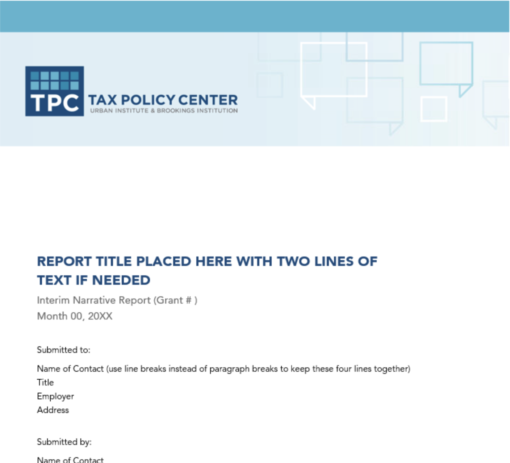
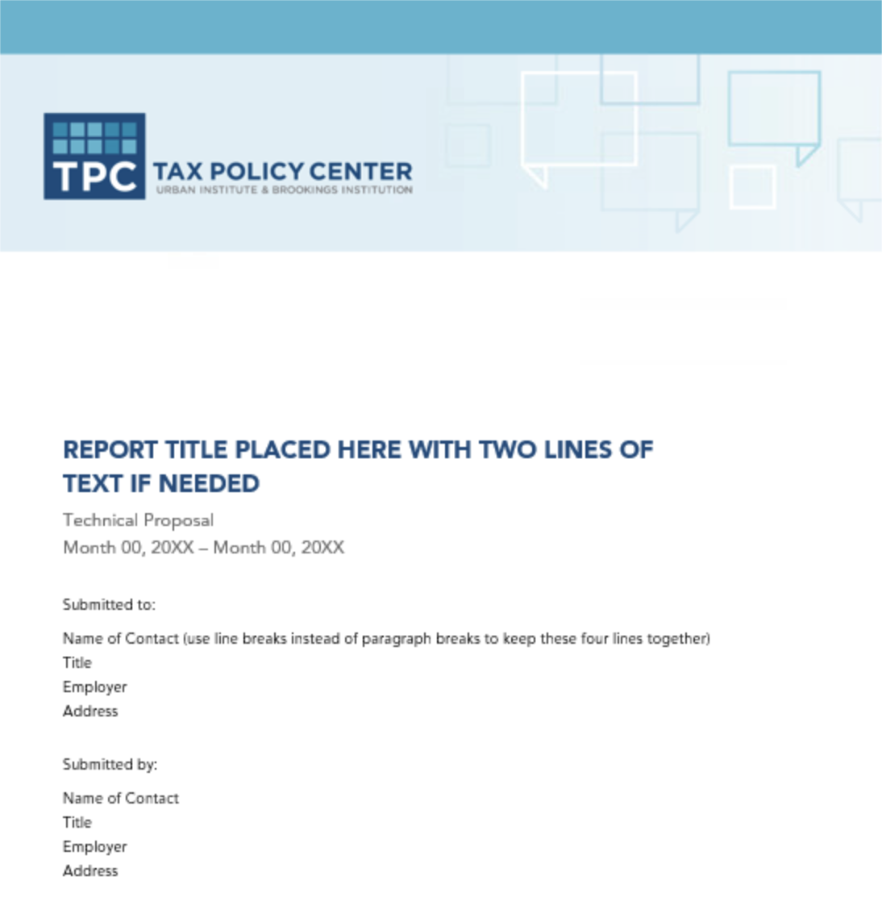
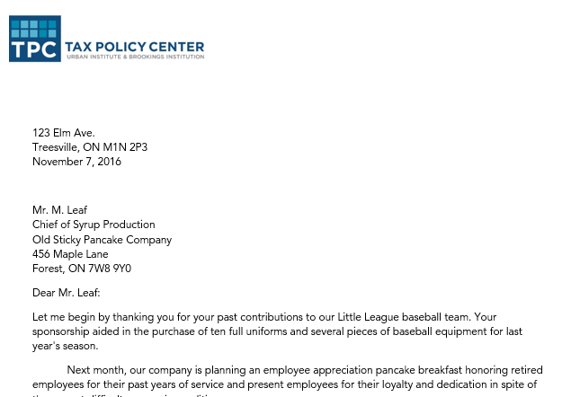
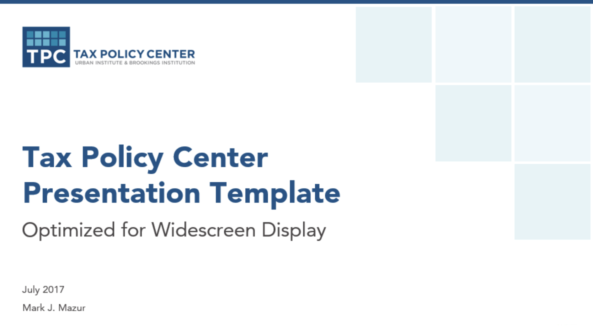

::::: {.callout-warning}
## STOP! - Required Setup

Before doing anything, you **must** download TPC's font to your computer.

**Step 1**: Download [this file](https://urbanorg.box.com/s/cj2gk9oqod0eq62f594tw7m7ycxjdst7)

{width=50%}

**Step 2**: Open the file from your downloads folder

{width=50%}

**Step 3**: Click "Install"

All done! If you have any questions about installing fonts, contact Lillian Hunter.
:::::

::::: {.callout-note}
**Reminder:** Have you submitted a [communications department intake form](https://airtable.com/appK6gouxwy0bCGsa/shrGYxMcQkzxryb3w) for your project yet?
:::::

The links below will always feature the most recent TPC templates. Please use them whenever you start a new project. Follow Urban's [guide to the publication process](https://urbanorg.app.box.com/s/yd6p7g8wnhy06sctgrggg055wv7b06pa)!

Also remember that if TPC is posting a publication, you need to fill out an [R&R](https://explorer.urban.org/page/4173?SearchId=0&R=). The R&R requires a short overview (or abstract) of your publication. See [Urban's guide to writing abstracts/overviews](https://urbanorg.app.box.com/s/azunbhlmml61gad1cbdg29d8cuh8p7un).

**Note:** TPC's templates have recently been updated.

# Templates

## Word Templates

### Shorter Publications

```{=html}
<table style="width: 100%; border-collapse: collapse;">
  <tbody>
    <tr>
      <td style="width: 33%; padding: 15px; border: 1px solid #ddd; vertical-align: top;">
        <p><a href="templates/TPC_Brief_1-Column_Template.dotx"><strong>Standard Brief (~10–20 pages)</strong></a>: Use to summarize research findings and highlight policy recommendations. Does not support a table of contents or appendixes. </p>
      </td>
      <td style="width: 33%; padding: 15px; border: 1px solid #ddd; vertical-align: top;">
        <p><a href="templates/TPC-2p-FactSheet-Template-v2.dotm"><strong>2-page fact sheet template</strong></a>: Use only as a companion product to summarize findings from a report or brief. Does not support citations. </p>
      </td>
      <td style="width: 33%; padding: 15px; border: 1px solid #ddd; vertical-align: top;">
        <p><a href="templates/TPC-Longer-FactSheet-Template.dotm"><strong>Longer fact sheet template</strong></a>: Use for short, informal, and less technical products. Similar to the two-page fact sheet template but supports notes and citations and can be a standalone product. <em>Any fact sheet longer than two pages must use this template.</em> </p>
      </td>
    </tr>
  </tbody>
</table>
```

### Research Reports and Papers

```{=html}
<table style="width: 100%; border-collapse: collapse;">
  <tbody>
    <tr>
      <td style="width: 50%; padding: 15px; border: 1px solid #ddd; vertical-align: top;">
        <p><a href="templates/TPC_Long_Research_Report_Template.dotx"><strong>Standard Report</strong></a>: Use for reports up to 60 pages long. Includes a table of contents, executive summary, appendixes, and an optional custom cover image. </p>
      </td>
      <td style="width: 50%; padding: 15px; border: 1px solid #ddd; vertical-align: top;">
        <p><a href="https://urbanorg.app.box.com/s/954fqlx6puyj8c2n01il0qvgo8yxaz0c"><strong>Working Paper</strong></a>: Use for preliminary findings and papers submitted to journals. Working papers do not receive standard copyediting support. </p>
      </td>
    </tr>
  </tbody>
</table>
```

### Business Documents

```{=html}
<table style="width: 100%; border-collapse: collapse;">
  <tbody>
    <tr>
      <td style="width: 33%; padding: 15px; border: 1px solid #ddd; vertical-align: top;">
        <p><a href="templates/TPC_Narrative_Report_Template.dotx"><strong>Narrative report template</strong></a> </p>
      </td>
      <td style="width: 33%; padding: 15px; border: 1px solid #ddd; vertical-align: top;">
        <p><a href="templates/TPC_Proposal_Template.dotx"><strong>Technical proposal template</strong></a> </p>
      </td>
      <td style="width: 33%; padding: 15px; border: 1px solid #ddd; vertical-align: top;">
        <p><a href="templates/TPC_letterhead.dotx"><strong>TPC letterhead template</strong></a>: Use for comment letters, memos, funder communications, and similar correspondence. </p>
      </td>
    </tr>
  </tbody>
</table>
```

## Graphing in Excel

- [Chart guide](templates/Chart_guide.xlsx)
- [TPC graph styles add-in](templates/TPCGraphingStyle.xlam)
- [Directions to download TPC graph styles add-in](templates/TPC-add-in-directions.pdf)

## PowerPoint

[**PowerPoint template (NEW 16x9 format)**](templates/tpc-presentation-full.pptx)

{width=50%}

## Mapping Resources

The resources below are useful for one-off maps. See [Urban's mapping guide](https://ui-research.github.io/code-library/mapping/mapping.html) for more detailed guidance.

- [Tile Grid Maps of the United States (Microsoft Excel)](templates/tile-maps_template_TPC.xlsx)
- [PowerPoint template (USA Map Template)](templates/EditableMapforTPC.pptx)
- [Map of the United States (Adobe Illustrator)](templates/USA_Map.ai)

